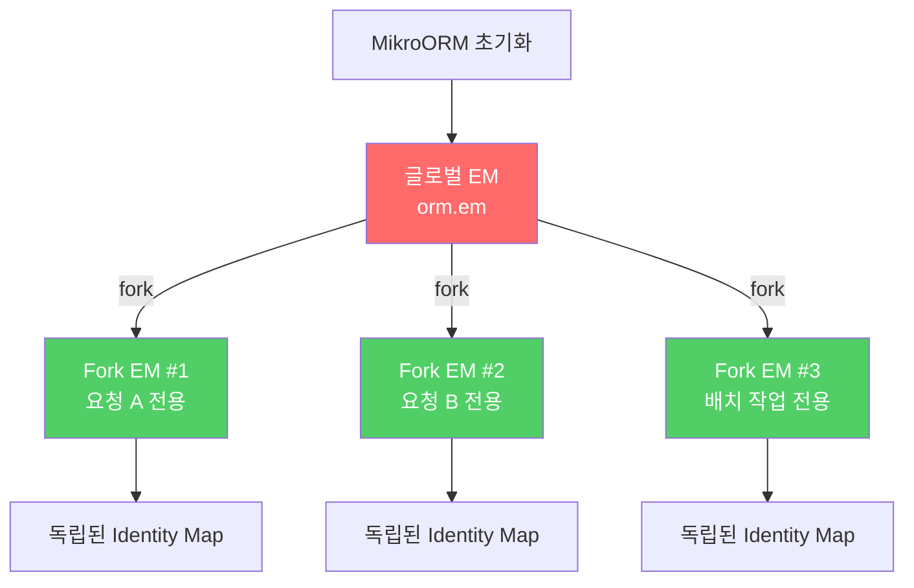
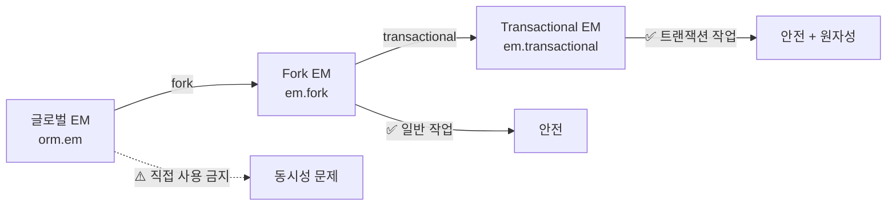
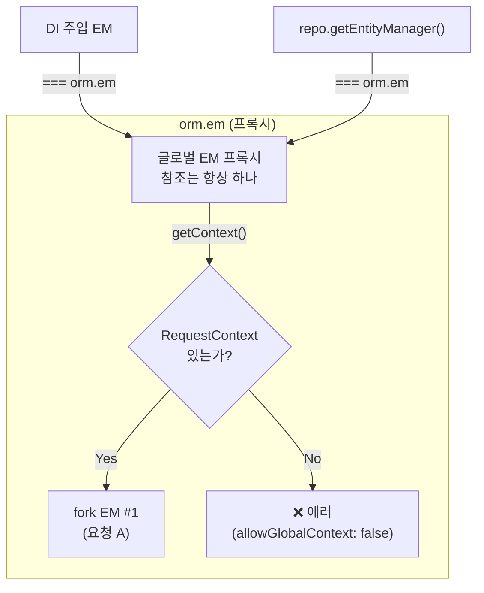
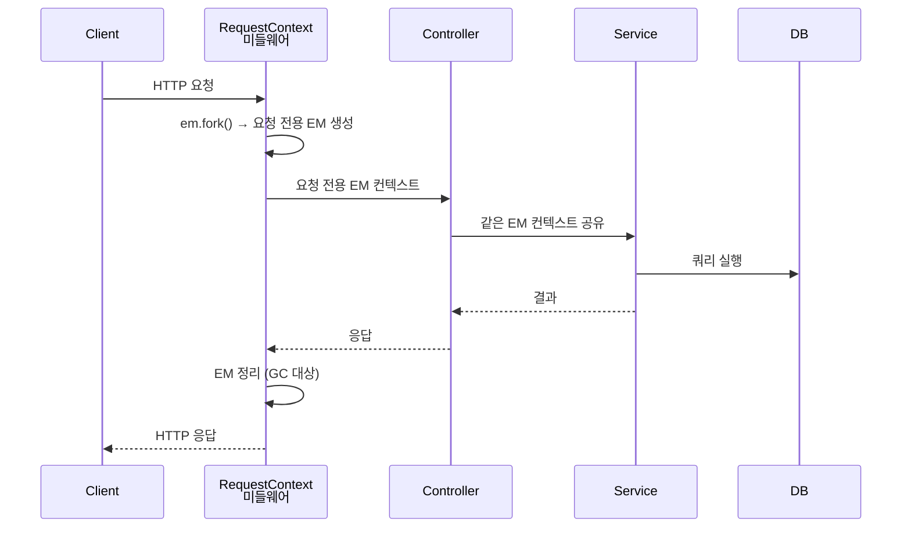

# 01. EntityManager — ORM의 심장

> **핵심 질문**: EM은 무엇이고, fork()는 왜 필요한가?

## 1.1 EntityManager란?

EntityManager(EM)는 MikroORM의 중심 객체다. 모든 DB 작업(조회, 저장, 삭제)은 EM을 통해 이루어진다.

EM은 두 가지 핵심 기능을 내장한다:

```
┌─────────────────────────────────┐
│         EntityManager           │
│                                 │
│  ┌───────────────────────────┐  │
│  │     Identity Map          │  │
│  │  (1차 캐시, PK → 객체)    │  │
│  └───────────────────────────┘  │
│                                 │
│  ┌───────────────────────────┐  │
│  │     Unit of Work          │  │
│  │  (변경 추적, SQL 생성)     │  │
│  └───────────────────────────┘  │
│                                 │
│  ┌───────────────────────────┐  │
│  │     Connection            │  │
│  │  (DB 커넥션 관리)          │  │
│  └───────────────────────────┘  │
└─────────────────────────────────┘
```

| 구성 요소 | 역할 | Spring JPA 대응 |
|-----------|------|----------------|
| Identity Map | 같은 PK → 같은 객체 보장 (1차 캐시) | Persistence Context |
| Unit of Work | 변경된 엔티티를 모아서 한 번에 SQL 실행 | Dirty Checking + Write Behind |
| Connection | DB 커넥션 풀 관리 | DataSource |

## 1.2 글로벌 EM vs fork()

MikroORM에서 가장 중요한 개념: **글로벌 EM을 직접 쓰지 마라.**



### 왜 fork()가 필요한가?

글로벌 EM은 **하나의 Identity Map**을 공유한다. 여러 요청이 동시에 같은 EM을 쓰면:

```
요청 A: user.name = "Alice"  ──┐
                                ├── 같은 Identity Map ──> 충돌!
요청 B: user.name = "Bob"    ──┘
```

`fork()`는 독립된 Identity Map을 가진 새 EM을 생성한다:

```typescript
// ❌ 위험 — 글로벌 EM 직접 사용
const user = await orm.em.findOne(User, 1);

// ✅ 안전 — fork된 EM 사용
const em = orm.em.fork();
const user = await em.findOne(User, 1);
```

### fork() 옵션

```typescript
// 기본 fork — 빈 Identity Map
const em1 = orm.em.fork();

// Identity Map 유지하면서 fork
const em2 = orm.em.fork({ clear: false });

// 읽기 전용 fork
const em3 = orm.em.fork({
  flushMode: FlushMode.COMMIT,      // 자동 flush 비활성화
  disableTransactions: true,         // 트랜잭션 없이 autocommit
});
```

## 1.3 EM의 세 가지 형태



| 형태 | 생성 방법 | 특징 |
|------|----------|------|
| 글로벌 EM | `orm.em` | 앱 전체 공유, 직접 사용 금지 |
| Fork EM | `orm.em.fork()` | 독립된 Identity Map, 요청별 사용 |
| Transactional EM | `em.transactional(cb)` | Fork EM + BEGIN/COMMIT 자동 관리 |

## 1.4 글로벌 EM은 프록시다

`orm.em`은 **프록시 객체**다. 실제 DB 연산을 직접 수행하지 않고, `getContext()`를 통해 현재 컨텍스트의 fork EM으로 위임한다.



```typescript
// 모두 같은 프록시 참조
const ref1 = orm.em;
const ref2 = module.get(EntityManager);
ref1 === ref2;  // true — NestJS 전역에 프록시 하나

// fork()하면 별개의 실제 EM 인스턴스
const fork1 = orm.em.fork();
const fork2 = orm.em.fork();
fork1 === fork2;  // false — 독립 인스턴스

// RequestContext마다 다른 fork로 해소
await RequestContext.create(orm.em, async () => {
  const ctx = (orm.em as any).getContext();
  ctx === orm.em;  // false — fork EM이 반환됨
});
```

## 1.5 NestJS에서의 EM 관리

NestJS에서는 `RequestContext` 미들웨어가 요청마다 자동으로 fork()를 수행한다:

```typescript
// NestJS 모듈 설정 — 프로덕션 권장
MikroOrmModule.forRoot({
  registerRequestContext: true,   // ← 요청마다 자동 fork
  allowGlobalContext: false,      // ← 글로벌 EM 직접 사용 차단
});
```



### allowGlobalContext: false가 중요한 이유

```
allowGlobalContext: true  → 글로벌 EM으로 직접 쿼리 가능 (위험)
allowGlobalContext: false → 글로벌 EM으로 직접 쿼리 시 에러 (안전)

영향 받는 것:  em.find(), em.persist(), em.flush() 등 Identity Map 연산
영향 없는 것:  em.fork(), em.getConnection() 등 메타 연산
```

`@Transactional()`이나 `RequestContext` 안에서는 프록시가 자동으로 fork EM으로 위임하므로 `allowGlobalContext: false`여도 정상 동작한다. **실수로 컨텍스트 없이 글로벌 EM을 쓸 때만 에러가 나는 안전장치**다.

## 1.6 검증된 동작 (테스트 기반)

| 테스트 | 검증 내용 |
|--------|----------|
| 4-1 | RequestContext 안에서 getContext() → fork EM 반환 (프록시 위임 확인) |
| 4-2 | RequestContext 없이 글로벌 EM 사용 → allowGlobalContext=false이면 에러 |
| 4-4 | repo.getEntityManager() === orm.em (같은 프록시), getContext()는 fork |
| 4-6 | orm.em 참조 동일성, fork()는 매번 별개, RC마다 다른 fork 반환 |
| 4-7 | DI 주입 EM === orm.em (프록시 하나), RC 안에서 같은 fork로 해소 |
| 8-1 | RequestContext 안에서 persist + flush 정상 동작 |
| 8-3 | 글로벌 EM 직접 사용 → allowGlobalContext=false이면 에러 |

---

[다음: 02. 엔티티 상태 머신 →](./02-entity-states.md)
