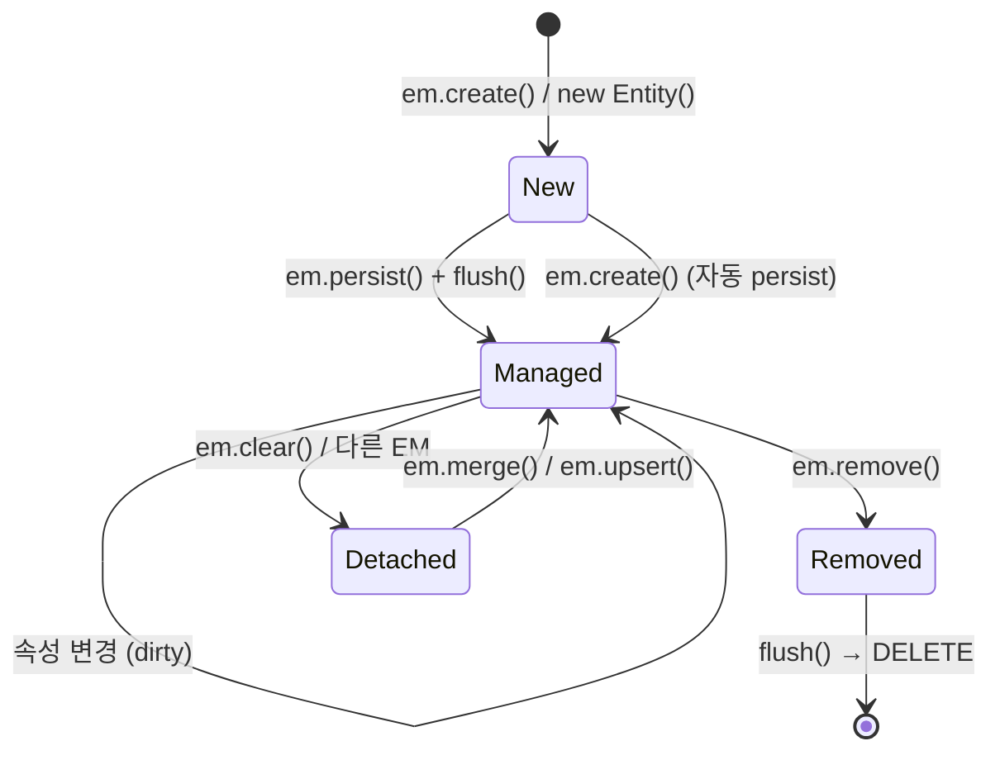
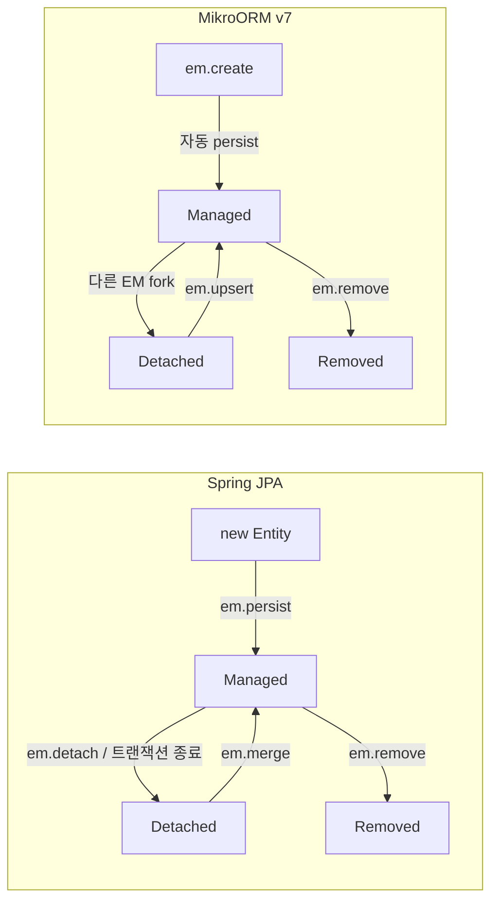

# 02. 엔티티 상태 머신

> **핵심 질문**: New, Managed, Detached, Removed는 어떻게 전이되는가?

## 2.1 네 가지 상태

엔티티는 EM과의 관계에 따라 네 가지 상태를 가진다:



| 상태 | 의미 | PK | Identity Map | DB 존재 |
|------|------|----|-------------|---------|
| **New** | 방금 생성, DB에 없음 | 없음 (보통) | X | X |
| **Managed** | EM이 추적 중 | 있음 | O | O |
| **Detached** | EM에서 분리됨 | 있음 | X | O |
| **Removed** | 삭제 예약됨 | 있음 | O (삭제 대기) | O (flush 전) |

## 2.2 helper() API로 상태 확인

MikroORM v7은 `helper()` 함수로 엔티티의 내부 상태를 조회할 수 있다:

```typescript
import { helper } from '@mikro-orm/core';

const wrapped = helper(entity);

// 주요 프로퍼티
wrapped.__managed          // boolean — EM에서 관리 중인가?
wrapped.__em               // EntityManager | undefined — 어떤 EM에 속해 있는가?
wrapped.hasPrimaryKey()    // boolean — PK가 할당되었는가?
wrapped.__originalEntityData  // object | undefined — DB에서 로드된 적 있는가?
wrapped.getPrimaryKey()    // PK 값
```

## 2.3 상태 전이 상세

### New → Managed

```typescript
const em = orm.em.fork();

// 방법 1: em.create() — MikroORM v7에서는 자동 persist
const user = em.create(User, { name: 'Alice' });
// → New 상태 (아직 PK 없음)
// → em.create()은 자동으로 persist() 호출

await em.flush();
// → INSERT 실행 → PK 할당 → Managed 상태

// 방법 2: 수동 persist
const user2 = new User();
user2.name = 'Bob';
em.persist(user2);  // 추적 시작
await em.flush();   // INSERT → Managed
```

### Managed → Managed (Dirty)

```typescript
const user = await em.findOne(User, 1);
// → Managed 상태 (Identity Map에 등록)

user.name = 'Changed';
// → 여전히 Managed, 하지만 dirty (변경 감지됨)

await em.flush();
// → UPDATE 실행 → 다시 clean Managed
```

### Managed → Detached

```typescript
const em1 = orm.em.fork();
const user = await em1.findOne(User, 1);
// → em1에서 Managed

const em2 = orm.em.fork();
// → user는 em2 입장에서 Detached
// → helper(user).__em === em1 (em2가 아님)
```

### Managed → Removed

```typescript
const user = await em.findOne(User, 1);
// → Managed

em.remove(user);
// → Removed (삭제 예약)

await em.flush();
// → DELETE 실행 → 사라짐
```

## 2.4 상태별 helper() 값

```
┌──────────────────────────────────────────────────────────────┐
│ 상태        │ __managed │ hasPrimaryKey │ __originalEntityData │
├──────────────────────────────────────────────────────────────┤
│ New         │ false     │ false         │ undefined            │
│ New (수동PK)│ false     │ true          │ undefined            │
│ Managed     │ true      │ true          │ { ... } (DB 스냅샷)  │
│ Detached    │ true *    │ true          │ { ... } (원래 EM 것) │
│ Removed     │ true      │ true          │ { ... }              │
└──────────────────────────────────────────────────────────────┘

* Detached 엔티티는 원래 EM에서의 __managed가 true이지만,
  현재 EM과 __em이 다르므로 "이 EM에서는 관리되지 않음"을 판단할 수 있다.
```

## 2.5 Spring JPA와의 비교



| 동작 | Spring JPA | MikroORM v7 |
|------|-----------|-------------|
| 엔티티 생성 | `new Entity()` + `em.persist()` | `em.create()` (자동 persist) |
| Detached 발생 | 트랜잭션 종료, `em.detach()` | 다른 EM fork, `em.clear()` |
| Detached → Managed | `em.merge()` (SELECT + UPDATE) | `em.upsert()` (INSERT ON DUPLICATE KEY UPDATE) |
| 상태 확인 | `em.contains(entity)` | `helper(entity).__managed` |

> **주의**: MikroORM의 `em.merge()`는 JPA의 `merge()`와 다르게 동작한다.
> MikroORM merge는 `__originalEntityData`를 현재 값으로 덮어쓰므로 dirty checking이 동작하지 않는다.
> Detached 엔티티의 변경을 DB에 반영하려면 `em.upsert()`를 사용해야 한다.

## 2.6 검증된 동작 (테스트 기반)

| 테스트 | 검증 내용 |
|--------|----------|
| 13-6 | helper() API로 New/Managed/Detached 상태 확인 |
| 13-1 | Detached 엔티티 save() → upsert UPDATE |
| 13-2 | Detached 엔티티 변경 없이 save() → 데이터 유지 |
| 5-1 | Dirty checking — 변경된 필드만 UPDATE |
| 1-1 | persist + flush → INSERT |

---

[← 이전: 01. EntityManager](./01-entity-manager.md) | [다음: 03. persist & flush →](./03-persist-and-flush.md)
