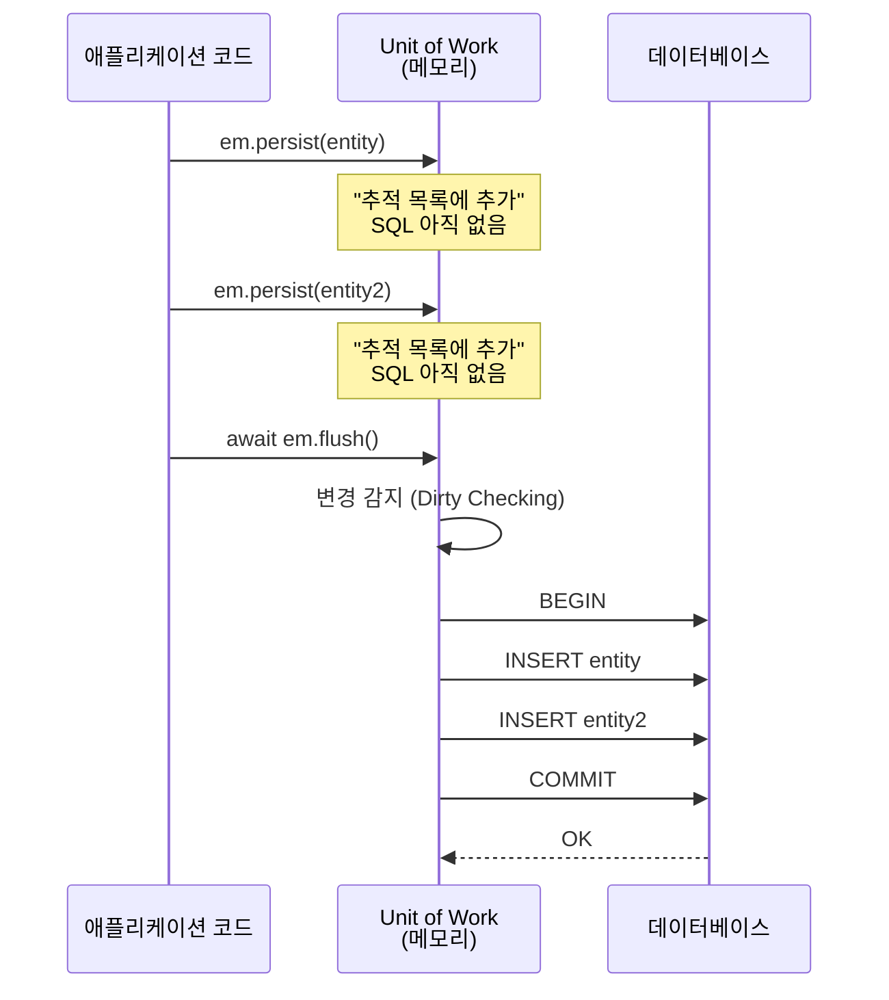
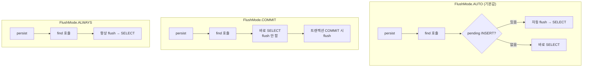

# 03. persist & flush — 쓰기의 두 단계

> **핵심 질문**: persist와 flush는 왜 분리되어 있는가?

## 3.1 두 단계의 분리

MikroORM의 쓰기는 두 단계로 나뉜다:



| 단계 | 메서드 | 하는 일 | SQL 실행 |
|------|--------|---------|---------|
| **추적** | `em.persist(entity)` | Unit of Work에 등록 | X |
| **실행** | `await em.flush()` | 변경 감지 → SQL 생성 → DB 전송 | O |

## 3.2 왜 분리했는가?

### 배치 최적화

```typescript
// ❌ 비효율 — INSERT 3번, 트랜잭션 3번
await em.persistAndFlush(user1);
await em.persistAndFlush(user2);
await em.persistAndFlush(user3);

// ✅ 효율 — INSERT 3번이지만 트랜잭션 1번
em.persist(user1);
em.persist(user2);
em.persist(user3);
await em.flush();  // BEGIN → INSERT × 3 → COMMIT
```

### 의존 관계 자동 정렬

```typescript
const author = em.create(Author, { name: 'Kim' });
const book = em.create(Book, { title: 'ORM Guide', author });
// author가 먼저 INSERT되어야 book의 FK가 유효

em.persist(author);
em.persist(book);
await em.flush();
// MikroORM이 자동으로 author → book 순서로 INSERT
```

## 3.3 em.create() vs new Entity()

MikroORM v7에서 `em.create()`는 **자동으로 persist**를 호출한다:

```typescript
// em.create() — persist 자동 호출
const user = em.create(User, { name: 'Alice' });
// → 이미 Unit of Work에 등록됨
await em.flush();  // INSERT 실행

// new Entity() — 수동 persist 필요
const user2 = new User();
user2.name = 'Bob';
em.persist(user2);  // 명시적으로 등록해야 함
await em.flush();
```

> **권장**: `em.create()`를 사용하라. 타입 안전성도 제공한다.

## 3.4 FlushMode — flush 타이밍 제어



| 모드 | 자동 flush 시점 | 용도 |
|------|----------------|------|
| `AUTO` | SELECT 전에 pending INSERT가 있으면 | 기본값, 대부분의 경우 |
| `COMMIT` | 트랜잭션 COMMIT 시에만 | 읽기 전용 컨텍스트 |
| `ALWAYS` | 매 쿼리 전 항상 | dirty UPDATE도 자동 flush 필요할 때 |

### AUTO의 동작 조건

**AUTO는 `em.persist()`로 등록된 변경 중, 쿼리 대상 엔티티 타입과 overlap이 있을 때만 자동 flush한다.**

두 가지 조건이 모두 충족되어야 auto flush가 발동한다:
1. `em.persist()`로 명시적으로 등록된 변경이 있어야 함
2. 조회하려는 엔티티 타입과 pending 변경의 엔티티 타입이 겹쳐야 함

```typescript
// FlushMode.AUTO에서의 동작

// Case 1: persist(Author) → find(Author) — 타입 overlap → auto flush ✅
em.persist(em.create(Author, { name: 'New' }));
const found = await em.find(Author, {});
// → INSERT가 먼저 실행되고 SELECT → 'New' 포함됨

// Case 2: persist(Author) → find(Book) — 타입 다름 → flush 안 함 ⚠️
em.persist(em.create(Author, { name: 'New' }));
await em.find(Book, {});
// → Author INSERT 없이 Book SELECT만 실행

// Case 3: dirty UPDATE — persist() 호출 안 함 → flush 안 됨 ⚠️
const author = await em.findOne(Author, 1);
author.name = 'Changed';
const result = await em.find(Author, { name: 'Changed' });
// → UPDATE 없이 SELECT → DB에서는 아직 'Changed'가 아님!
// (dirty 엔티티에 em.persist()를 호출하면 AUTO flush 대상이 됨)
```

> **Spring JPA와의 차이**: JPA의 FlushMode.AUTO는 dirty UPDATE도 자동 flush한다.
> MikroORM의 AUTO는 `em.persist()`로 등록된 변경만 감지한다.
> dirty UPDATE를 자동 flush하려면 `FlushMode.ALWAYS`를 사용하거나 명시적으로 `flush()`를 호출해야 한다.

## 3.5 persist vs persistAndFlush

```
em.persist(entity)         →  추적만 (SQL 없음)
await em.flush()           →  모든 변경 사항 한 번에 실행

await em.persistAndFlush(entity)  →  persist + flush 한 번에
                                     (편리하지만 비효율적일 수 있음)
```

## 3.6 flush가 하는 일 (내부 동작)

```
flush() 호출
  │
  ├─ 1. Change Set 계산
  │     - New 엔티티 → INSERT
  │     - Dirty 엔티티 → UPDATE (변경된 필드만)
  │     - Removed 엔티티 → DELETE
  │
  ├─ 2. 실행 순서 정렬
  │     - FK 의존성 순서대로 정렬
  │     - INSERT: 부모 → 자식
  │     - DELETE: 자식 → 부모
  │
  ├─ 3. 트랜잭션 실행
  │     - BEGIN
  │     - SQL 실행 (INSERT, UPDATE, DELETE)
  │     - COMMIT
  │
  └─ 4. Identity Map 갱신
        - __originalEntityData 업데이트
        - Removed 엔티티 제거
```

## 3.7 검증된 동작 (테스트 기반)

| 테스트 | 검증 내용 |
|--------|----------|
| 1-1 | 새 엔티티 persist + flush → INSERT |
| 1-2 | managed 엔티티에 persist + flush (변경 없음) → 쿼리 없음 |
| 1-3 | 새 엔티티 persist 2번 + flush → INSERT 1회 (Set 중복 무해) |
| 1-6 | em.create() + flush (persist 호출 없이) → persistOnCreate 동작 확인 |
| 3-1 | FlushMode.AUTO — persist(Author) → find(Author) → auto flush 후 조회 |
| 3-4 | FlushMode.AUTO — dirty UPDATE는 auto flush 안 됨 |
| 3-5 | FlushMode.COMMIT — persist → find → flush 안 함 |

---

[← 이전: 02. 엔티티 상태 머신](./02-entity-states.md) | [다음: 04. @Transactional() →](./04-transactional.md)
