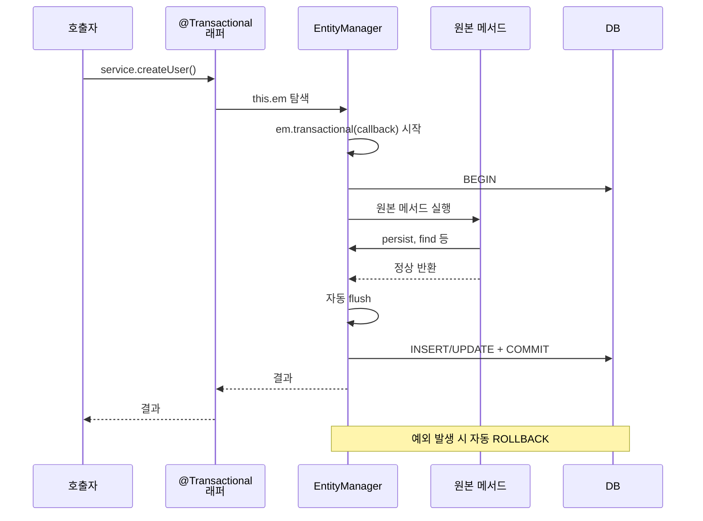
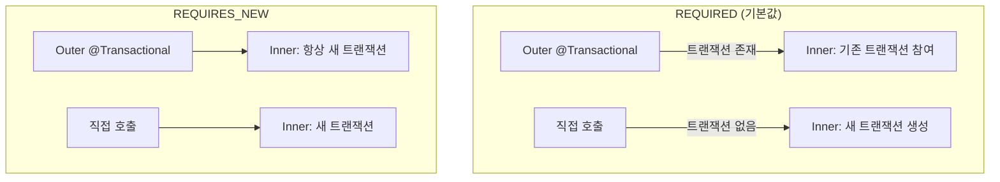
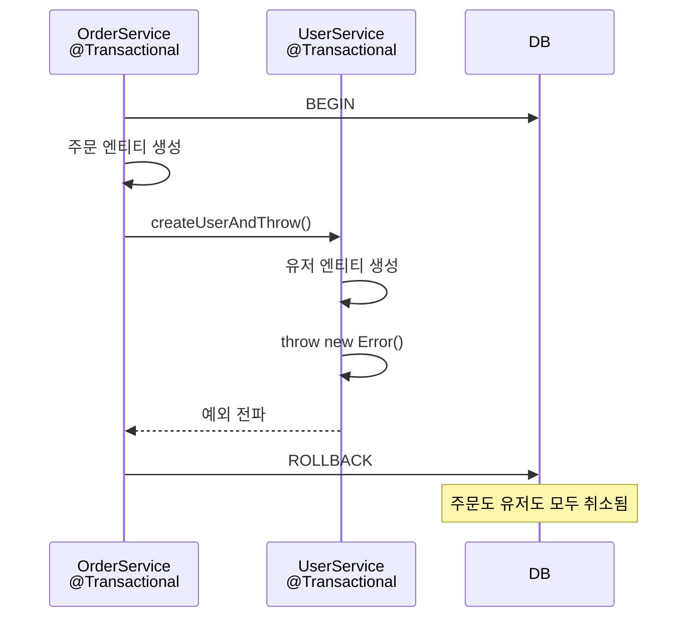
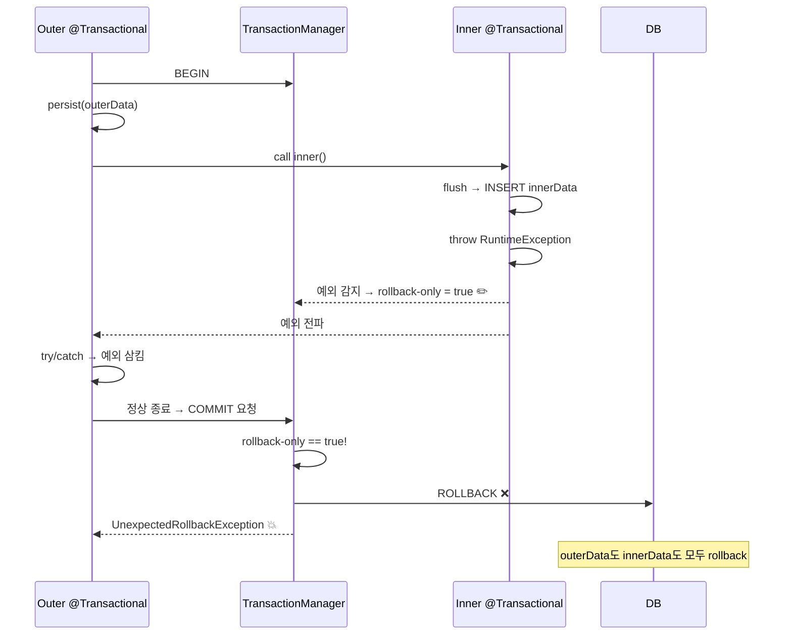
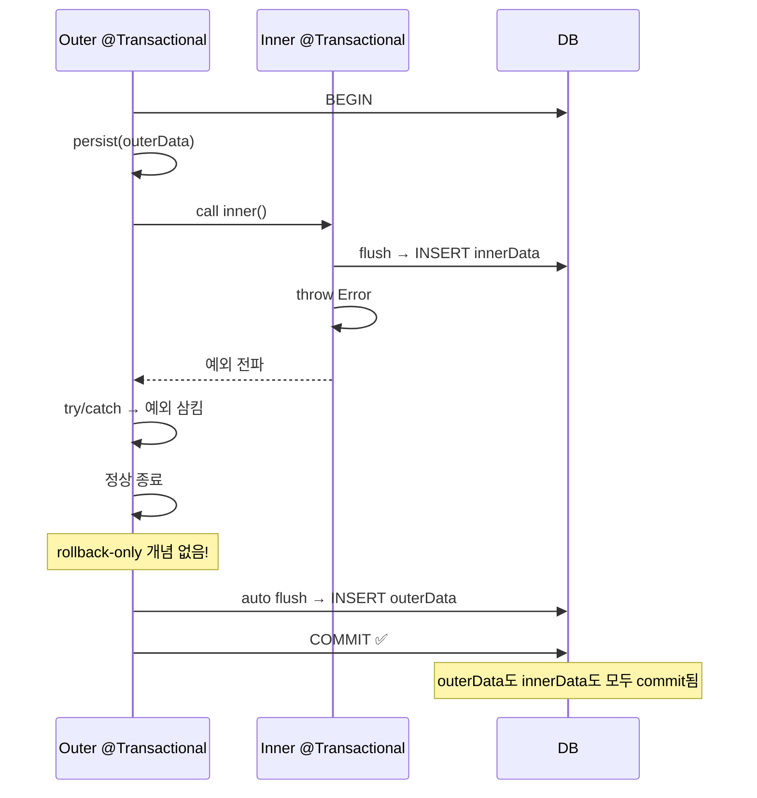

# 04. @Transactional() 데코레이터

> **핵심 질문**: 데코레이터 하나로 트랜잭션이 어떻게 관리되는가?

## 4.1 동작 원리

`@Transactional()`은 메서드를 `em.transactional()` 래퍼로 교체한다:



### 실제 코드 기반 동작 (소스 확인)

#### Step 1: `@Transactional()` 데코레이터

```typescript
// @mikro-orm/decorators — Transactional.js
descriptor.value = async function (...args) {
  txOptions.propagation ??= TransactionPropagation.REQUIRED;

  // EM 탐색 우선순위:
  //   1) this.em 또는 this.orm.em (resolveContextProvider)
  //   2) TransactionContext.getEntityManager() — ALS에서 현재 TX의 fork EM
  //   3) RequestContext.getEntityManager() — RC에서 fork EM
  const em = resolveContextProvider(this, context)
          || TransactionContext.getEntityManager()
          || RequestContext.getEntityManager();

  if (!em) throw new Error('@Transactional() can only be applied to ...');
  //   → em이 없으면 여기서 에러 (TransactionalExplorer가 해결, 11장 참고)

  return em.transactional(() => originalMethod.apply(this, args), txOptions);
};
```

#### Step 2: `em.transactional()` → TransactionManager

```typescript
// @mikro-orm/core — EntityManager.js
async transactional(cb, options) {
  const em = this.getContext(false);
  const manager = new TransactionManager(this);
  return manager.handle(cb, options);
}
```

#### Step 3: TransactionManager — REQUIRED 전파 분기

```typescript
// @mikro-orm/core — TransactionManager.js
async handle(cb, options) {
  const hasExistingTx = !!em.getTransactionContext();

  // REQUIRED:
  if (hasExistingTx) return cb(em);        // 기존 TX에 참여 (fork 안 함!)
  return this.createNewTransaction(em, cb); // 새 TX 생성
}
```

#### Step 4: 새 트랜잭션 생성 — fork + AsyncLocalStorage

```typescript
// @mikro-orm/core — TransactionManager.js
async createNewTransaction(em, cb, options) {
  const fork = em.fork({ ... });  // fork EM 생성

  // TransactionContext.create → AsyncLocalStorage.run(fork, callback)
  //   → 이 시점부터 ALS에 fork EM이 저장됨
  return TransactionContext.create(fork, () =>
    fork.getConnection().transactional(async trx => {
      fork.setTransactionContext(trx);   // BEGIN
      const ret = await cb(fork);        // callback 실행
      await fork.flush();                // 자동 flush
      // COMMIT (connection.transactional이 처리)
      mergeEntitiesToParent(fork, em);   // fork → 부모 EM으로 엔티티 동기화
      return ret;
    })
  );
}
```

#### Step 5: callback 안에서 `this.em.find()` 호출 시

```typescript
// @mikro-orm/core — EntityManager.js
getContext(validate = true) {
  // 1순위: ALS의 TransactionContext에서 fork EM
  let em = TransactionContext.getEntityManager(this.name);
  if (em) return em;

  // 2순위: RequestContext의 fork EM
  em = this.config.get('context')(this.name) ?? this;

  // 둘 다 없고 allowGlobalContext=false → 에러
  if (validate && !this.config.get('allowGlobalContext') && em.global) {
    throw ValidationError.cannotUseGlobalContext();
  }
  return em;
}
```

> **전체 흐름 요약**:
> `@Transactional()` → `this.em` 탐색 → `em.transactional()` → `TransactionManager`가 fork 생성 → `AsyncLocalStorage.run(fork, ...)` → callback 안에서 `this.em.find()` → 프록시의 `getContext()` → ALS에서 fork EM 반환 → fork EM으로 위임.
>
> **REQUIRED 전파에서 기존 TX가 있으면** fork를 만들지 않고 `cb(em)`으로 그대로 실행한다. ALS에 이미 fork가 있으므로 `getContext()`가 그것을 반환한다.
>
> **트랜잭션 종료 후** `mergeEntitiesToParent()`가 fork의 엔티티를 부모 EM의 Identity Map에 동기화한다.

## 4.2 this.em 요구사항

`@Transactional()`은 반드시 `this.em` 또는 `this.orm`이 필요하다:

```typescript
// ❌ 에러 — em이 없음
@Injectable()
class UserService {
  @Transactional()
  async createUser() { /* ... */ }
}
// → "@Transactional() can only be applied to methods of classes
//    with `orm: MikroORM` property, `em: EntityManager` property..."

// ✅ 방법 1: 직접 주입
@Injectable()
class UserService {
  constructor(private readonly em: EntityManager) {}

  @Transactional()
  async createUser() { /* ... */ }
}

// ✅ 방법 2: TransactionalExplorer 사용 (11장 참고)
// → em을 자동 주입하므로 constructor에 em 불필요
```

## 4.3 Propagation — 트랜잭션 전파



| Propagation | 기존 TX 있을 때 | 기존 TX 없을 때 |
|-------------|----------------|----------------|
| `REQUIRED` (기본) | 참여 | 새로 생성 |
| `REQUIRES_NEW` | 새로 생성 (기존 일시 중단) | 새로 생성 |
| `SUPPORTS` | 참여 | TX 없이 실행 |
| `MANDATORY` | 참여 | 에러 |
| `NOT_SUPPORTED` | TX 없이 실행 (기존 일시 중단) | TX 없이 실행 |
| `NEVER` | 에러 | TX 없이 실행 |

### 전파 예시

```typescript
@Injectable()
class OrderService {
  @Transactional()  // Outer — 새 트랜잭션 생성
  async createOrder(userName: string) {
    // ... 주문 로직

    // Inner — REQUIRED이므로 Outer의 트랜잭션에 참여
    await this.userService.createUser(userName);

    // 여기서 예외 발생하면?
    // → Outer + Inner 모두 ROLLBACK (같은 트랜잭션이므로)
  }
}

@Injectable()
class UserService {
  @Transactional()  // REQUIRED — 바깥 트랜잭션 있으면 참여
  async createUser(name: string) {
    return this.userRepo.create({ name });
  }
}
```

## 4.4 Rollback 동작



```typescript
// 검증된 동작: Inner 예외 → 전체 rollback
@Transactional()
async createOrderWithUserThrow(userName: string) {
  this.userRepo.create({ name: 'Order Owner' });     // ← 이것도 rollback됨
  await this.userService.createUserAndThrow(userName); // ← 여기서 throw
}
```

## 4.5 예외를 catch하면? — Spring과의 결정적 차이

### Spring: rollback-only 마킹

Spring에서는 inner `@Transactional`(REQUIRED)이 예외를 던지면, **TransactionManager가 TX에 rollback-only 플래그를 세팅**한다. outer에서 catch로 삼켜도 commit 시점에 `UnexpectedRollbackException`이 발생한다.



### MikroORM: rollback-only가 없다

MikroORM의 `@Transactional()`은 단순한 try-catch 래퍼다. TX 상태를 중앙 관리하는 TransactionManager가 없으므로, **예외를 catch하면 정상 흐름으로 이어져서 commit된다.**



### 4가지 케이스 완전 정리

예외 발생 위치(Inner/Outer) × catch 여부 = 4가지 조합:

```
┌─────────────────────────────────────────────────────────────────┐
│                    예외 catch 안 함 (전파)                        │
├──────────────────────────────┬──────────────────────────────────┤
│ Case A: Inner throw → 전파   │ Case C: Outer throw (Inner 성공)  │
│                              │                                  │
│ → 전체 ROLLBACK              │ → 전체 ROLLBACK                   │
│ → Spring과 동일              │ → Inner 데이터도 사라짐            │
│ (테스트 12-1)                │ (테스트 12-4)                     │
├──────────────────────────────┼──────────────────────────────────┤
│                    예외 catch (삼킴)                              │
├──────────────────────────────┼──────────────────────────────────┤
│ Case B: Inner throw          │ Case D: Outer 자체 try-catch      │
│       → Outer catch          │                                  │
│                              │                                  │
│ → MikroORM: COMMIT ✅        │ → COMMIT ✅                       │
│ → Spring: ROLLBACK ❌        │ → Spring과 동일                   │
│ (테스트 12-2)                │ (테스트 12-5)                     │
└──────────────────────────────┴──────────────────────────────────┘
```

| Case | 예외 위치 | catch | MikroORM | Spring | 차이 |
|------|----------|-------|----------|--------|------|
| A | Inner | 전파 | 전체 rollback | 전체 rollback | 동일 |
| B | Inner | Outer에서 catch | **commit** | **rollback** (rollback-only) | **다름** |
| C | Outer (Inner 성공 후) | 전파 | 전체 rollback | 전체 rollback | 동일 |
| D | Outer 내부 | 자체 catch | commit | commit | 동일 |

> **Case B만 Spring과 다르다.** 나머지 3개는 동일하게 동작한다.

### 왜 다른가

```
Spring — TransactionManager가 TX 상태를 중앙 관리
  TransactionStatus.rollbackOnly = true  ← 예외 시 자동 세팅
  commit() 시 플래그 확인 → ROLLBACK

MikroORM — 메서드 레벨 try-catch일 뿐
  try { method(); flush(); COMMIT }
  catch { ROLLBACK; throw }
  → outer에서 catch하면 래퍼 입장에서는 "정상 종료"
```

### 주의: inner의 flush 데이터가 살아남는다

```typescript
@Transactional()
async outer() {
  this.em.persist(outerEntity);

  try {
    await this.inner.doSomethingAndThrow();
    // inner 안에서 flush → INSERT 실행됨
    // inner에서 throw → 여기서 catch
  } catch {
    // 예외 삼킴
  }

  // ⚠️ inner가 flush한 데이터도 같은 TX → commit 시 함께 저장됨!
}
```

### 안전한 패턴

```typescript
// 패턴 1: inner 부분 실패를 허용 — catch로 삼김
@Transactional()
async processOrder() {
  this.em.persist(order);
  try {
    await this.notificationService.sendEmail(); // 실패해도 OK
  } catch {
    order.emailSent = false; // 실패 기록만
  }
}

// 패턴 2: inner 실패 시 전체 rollback — catch 안 함
@Transactional()
async processPayment() {
  this.em.persist(order);
  await this.paymentService.charge(); // 실패 → 전체 rollback
}

// 패턴 3: 커스텀 에러로 re-throw → rollback
@Transactional()
async processPayment() {
  this.em.persist(order);
  try {
    await this.paymentService.charge();
  } catch (e) {
    throw new PaymentFailedException(e); // re-throw → rollback
  }
}
```

## 4.6 옵션

```typescript
@Transactional({
  readOnly: true,                           // DB 레벨 읽기 전용 (5장 참고)
  isolationLevel: IsolationLevel.SERIALIZABLE,
  propagation: TransactionPropagation.REQUIRES_NEW,
  flushMode: FlushMode.COMMIT,
})
async someMethod() { /* ... */ }
```

## 4.7 검증된 동작 (테스트 기반)

| 테스트 | 검증 내용 |
|--------|----------|
| 2-1 | @Transactional() → persist + 자동 flush → INSERT |
| 2-2 | @Transactional() 예외 → ROLLBACK |
| 2-3 | 중첩 @Transactional — Outer + Inner 정상 commit |
| 2-4 | 중첩 @Transactional — Inner 예외 → 전체 ROLLBACK |
| 11-1 | em 미주입 서비스에서 Explorer 통한 @Transactional 동작 |
| 11-3 | 서비스 간 트랜잭션 전파 (Outer → Inner) |
| 11-4 | Inner 예외 → 전체 rollback |
| 12-1 | Case A: Inner 예외 전파 → 전체 rollback (Spring과 동일) |
| 12-2 | Case B: Inner 예외를 Outer에서 catch → **commit 성공** (Spring은 UnexpectedRollbackException) |
| 12-3 | Case B 변형: Inner 예외 catch 후 recovery 데이터 추가 → 전부 commit |
| 12-4 | Case C: Inner 성공 후 Outer throw → 전체 rollback (Inner 데이터도 사라짐) |
| 12-5 | Case D: Inner 성공 후 Outer 자체 catch → commit 성공 |
| 12-6 | em.transactional()에서도 동일 — 예외 catch → commit 성공 |
| 12-7 | 대조군: em.transactional() 예외 미처리 → 전체 rollback |

---

[← 이전: 03. persist & flush](./03-persist-and-flush.md) | [다음: 05. Readonly & CQRS →](./05-readonly-cqrs.md)
