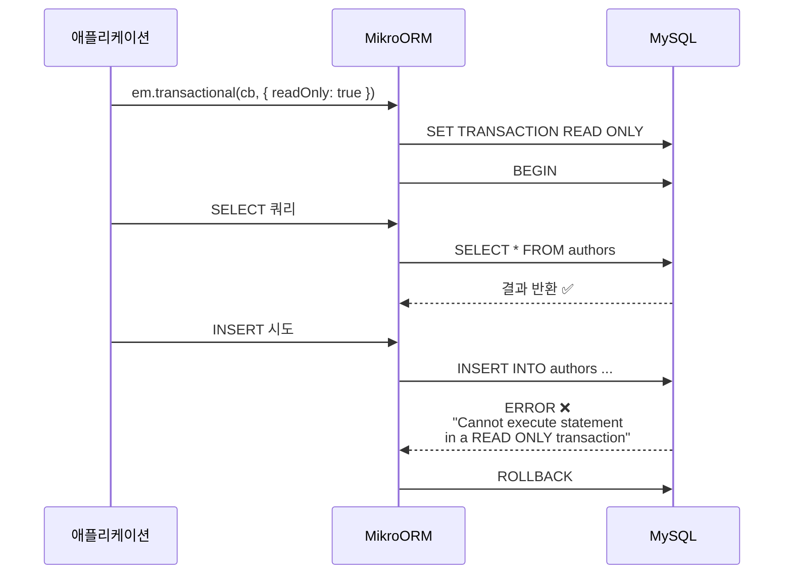
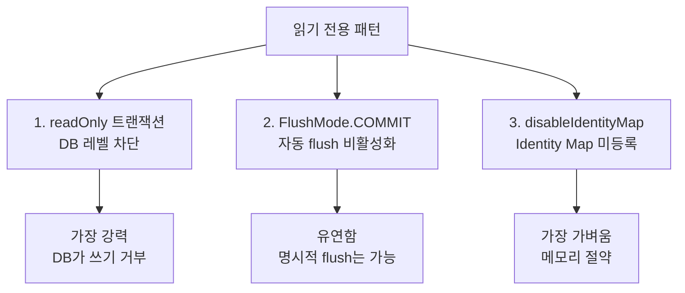
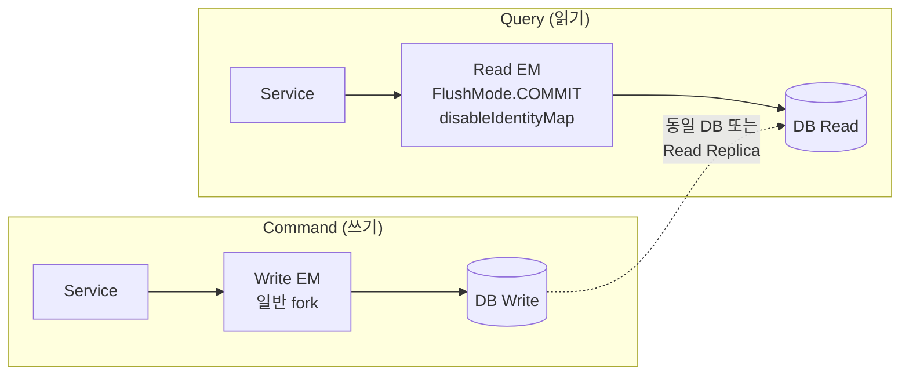

# 05. Readonly 트랜잭션 & CQRS

> **핵심 질문**: 읽기 전용 트랜잭션은 ORM 레벨인가, DB 레벨인가?

## 5.1 Readonly 트랜잭션

**DB 레벨에서 쓰기를 차단**한다. ORM이 막는 게 아니라, MySQL이 `SET TRANSACTION READ ONLY`를 실행하여 DB 엔진이 직접 거부한다.



```typescript
// 읽기 전용 트랜잭션
await em.transactional(async (txEm) => {
  // ✅ SELECT — 정상
  const authors = await txEm.find(Author, {});

  // ❌ INSERT — DB가 거부
  txEm.create(Author, { name: 'Blocked' });
  await txEm.flush();  // → ERROR!
}, { readOnly: true });
```

## 5.2 읽기 전용 EM 패턴 3가지



### 패턴 1: readOnly 트랜잭션

```typescript
// DB가 INSERT/UPDATE/DELETE를 거부
const result = await em.transactional(
  async (txEm) => txEm.find(Author, {}),
  { readOnly: true }
);
```

### 패턴 2: FlushMode.COMMIT

```typescript
// 자동 flush 안 됨, 하지만 명시적 flush는 가능
const readEm = orm.em.fork({ flushMode: FlushMode.COMMIT });
const authors = await readEm.find(Author, {});

// persist해도 find 전에 자동 flush 안 됨
readEm.persist(readEm.create(Author, { name: 'Pending' }));
const recheck = await readEm.find(Author, {});
// → 'Pending'은 아직 DB에 없으므로 결과에 미포함
```

### 패턴 3: disableIdentityMap

```typescript
// Identity Map에 등록하지 않는 순수 읽기
const authors = await em.find(Author, {}, {
  disableIdentityMap: true
});

// 결과를 수정해도 flush 시 UPDATE 안 됨
authors[0].name = 'Changed';
await em.flush();  // → 아무 SQL도 실행 안 됨
```

## 5.3 CQRS 패턴 구현

Command(쓰기)와 Query(읽기)를 분리하는 아키텍처:



```typescript
// CQRS 패턴 — 읽기/쓰기 EM 분리
class AuthorService {

  // Command — 일반 EM
  async createAuthor(name: string) {
    const writeEm = this.orm.em.fork();
    const author = writeEm.create(Author, { name });
    writeEm.persist(author);
    await writeEm.flush();
    return author;
  }

  // Query — 경량 읽기 EM
  async findAll() {
    const readEm = this.orm.em.fork({
      flushMode: FlushMode.COMMIT,
    });
    return readEm.find(Author, {}, {
      disableIdentityMap: true,
    });
  }

  // Query — 일관된 스냅샷 읽기
  async getConsistentSnapshot() {
    const em = this.orm.em.fork();
    return em.transactional(
      async (txEm) => ({
        authors: await txEm.find(Author, {}),
        books: await txEm.find(Book, {}),
      }),
      {
        readOnly: true,
        isolationLevel: IsolationLevel.REPEATABLE_READ,
      },
    );
  }
}
```

## 5.4 disableTransactions 모드

```typescript
// 트랜잭션 없이 autocommit 모드
const em = orm.em.fork({ disableTransactions: true });

author.name = 'AutoCommit';
await em.flush();
// → BEGIN/COMMIT 없이 바로 UPDATE 실행
// → 여러 엔티티 변경 시 비원자적 (일부만 반영될 수 있음)
```

> **주의**: `disableTransactions`에서는 flush가 실패하면 일부 변경만 커밋될 수 있다.

## 5.5 getConnection('read' | 'write')

```typescript
// Read Replica 설정 시 자동 분리
const readConn = em.getConnection('read');   // → replica
const writeConn = em.getConnection('write'); // → primary

// replica 미설정 시 동일 커넥션 반환
```

Read Replica 설정 예시:

```typescript
MikroOrmModule.forRoot({
  host: 'primary.db.com',
  replicas: [
    { host: 'replica-1.db.com' },
    { host: 'replica-2.db.com' },
  ],
  preferReadReplicas: true,  // SELECT 자동으로 replica 사용
});
```

## 5.6 패턴 선택 가이드

```
읽기 전용이 필요한가?
  │
  ├─ 절대 쓰면 안 됨 (보안/규정) → readOnly: true
  │
  ├─ 쓸 일 없지만 실수 방지 → FlushMode.COMMIT
  │
  ├─ 대량 조회 (메모리 절약) → disableIdentityMap
  │
  └─ 일관된 스냅샷 필요 → readOnly + REPEATABLE_READ
```

## 5.7 검증된 동작 (테스트 기반)

| 테스트 | 검증 내용 |
|--------|----------|
| 11-1 | readOnly 트랜잭션 안에서 SELECT 정상 |
| 11-2 | readOnly 트랜잭션 안에서 INSERT → DB 거부 |
| 11-3 | readOnly 트랜잭션 안에서 UPDATE → DB 거부 |
| 11-4 | FlushMode.COMMIT → persist해도 자동 flush 안 됨 |
| 11-5 | em.fork({ flushMode: COMMIT }) 패턴 |
| 11-6 | disableIdentityMap → Identity Map 미등록 |
| 11-7 | disableIdentityMap 엔티티 수정 → UPDATE 안 됨 |
| 11-8 | disableTransactions → autocommit 모드 |
| 11-13 | CQRS 읽기/쓰기 EM 분리 |
| 11-14 | readOnly + REPEATABLE_READ 스냅샷 |
| 11-15 | getConnection('read'/'write') API |

---

[← 이전: 04. @Transactional()](./04-transactional.md) | [다음: 06. 비관적 잠금 →](./06-pessimistic-locking.md)
