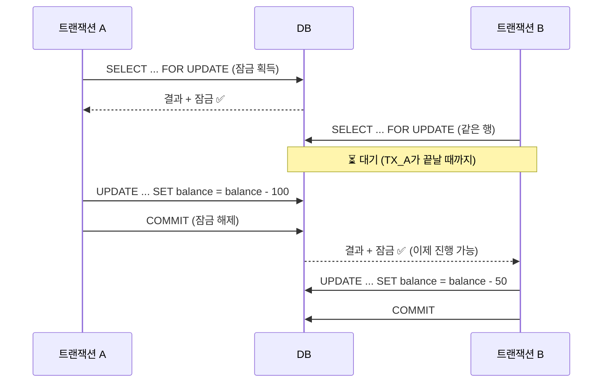
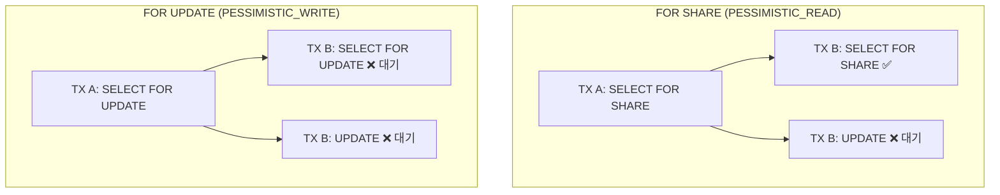

# 06. 비관적 잠금 (Pessimistic Locking)

> **핵심 질문**: FOR UPDATE/FOR SHARE는 언제, 어떻게 쓰는가?

## 6.1 비관적 잠금이란?

DB 행에 **잠금을 걸어** 다른 트랜잭션의 접근을 제어하는 방식이다.



## 6.2 LockMode 종류

### 비관적 잠금 모드

| LockMode | SQL | 다른 TX의 일반 SELECT | 다른 TX의 FOR UPDATE | 다른 TX의 쓰기 | 용도 |
|----------|-----|---------------------|---------------------|---------------|------|
| `PESSIMISTIC_WRITE` | `FOR UPDATE` | 허용 | 차단 | 차단 | 잔액 차감, 재고 감소 |
| `PESSIMISTIC_READ` | `FOR SHARE` | 허용 | 차단 | 차단 | 일관된 읽기 보장 |
| `PESSIMISTIC_WRITE_OR_FAIL` | `FOR UPDATE NOWAIT` | 허용 | 즉시 에러 | 즉시 에러 | 대기 없이 즉시 실패 |
| `PESSIMISTIC_READ_OR_FAIL` | `FOR SHARE NOWAIT` | 허용 | 즉시 에러 | 즉시 에러 | 대기 없이 읽기 잠금 |
| `PESSIMISTIC_PARTIAL_WRITE` | `FOR UPDATE SKIP LOCKED` | 허용 | 잠긴 행 건너뜀 | 잠긴 행 건너뜀 | 큐 패턴 |
| `PESSIMISTIC_PARTIAL_READ` | `FOR SHARE SKIP LOCKED` | 허용 | 잠긴 행 건너뜀 | 잠긴 행 건너뜀 | 큐 읽기 패턴 |

### 기타 잠금 모드

| LockMode | 동작 |
|----------|------|
| `NONE` | 잠금 없음 |
| `OPTIMISTIC` | 버전 필드(`@Version`)를 이용한 낙관적 잠금 |

## 6.3 사용법

```typescript
import { LockMode } from '@mikro-orm/core';

// ✅ 반드시 트랜잭션 안에서 사용
await em.transactional(async (txEm) => {

  // FOR UPDATE — 배타적 잠금
  const account = await txEm.findOneOrFail(
    Account,
    { id: 1 },
    { lockMode: LockMode.PESSIMISTIC_WRITE },
  );
  // → SELECT * FROM accounts WHERE id = 1 FOR UPDATE

  account.balance -= 100;
  await txEm.flush();
  // → UPDATE accounts SET balance = ? WHERE id = 1
  // → COMMIT → 잠금 해제
});
```

```typescript
// ❌ 트랜잭션 밖에서 사용하면 에러
const author = await em.findOneOrFail(
  Author,
  1,
  { lockMode: LockMode.PESSIMISTIC_WRITE },
);
// → Error: Pessimistic locking requires a transaction
```

## 6.4 실전 시나리오

### 잔액 차감 (Race Condition 방지)

```typescript
@Transactional()
async withdraw(accountId: number, amount: number) {
  // 잠금 획득 — 다른 트랜잭션 대기
  const account = await this.em.findOneOrFail(
    Account,
    accountId,
    { lockMode: LockMode.PESSIMISTIC_WRITE },
  );

  if (account.balance < amount) {
    throw new Error('잔액 부족');
  }

  account.balance -= amount;
  // flush → UPDATE → COMMIT → 잠금 해제
}
```

### 큐 처리 (SKIP LOCKED)

```typescript
@Transactional()
async processNextJob() {
  // 다른 워커가 처리 중인 행은 건너뜀
  const job = await this.em.findOne(
    Job,
    { status: 'pending' },
    {
      lockMode: LockMode.PESSIMISTIC_PARTIAL_WRITE,
      orderBy: { createdAt: 'ASC' },
    },
  );
  // → SELECT ... WHERE status = 'pending'
  //   ORDER BY created_at ASC LIMIT 1
  //   FOR UPDATE SKIP LOCKED

  if (!job) return null;

  job.status = 'processing';
  return job;
}
```

## 6.5 FOR SHARE vs FOR UPDATE



## 6.6 검증된 동작 (테스트 기반)

| 테스트 | 검증 내용 |
|--------|----------|
| 11-10 | PESSIMISTIC_WRITE → FOR UPDATE 쿼리 생성 + 변경 가능 |
| 11-11 | PESSIMISTIC_READ → FOR SHARE 쿼리 생성 |
| 11-12 | 트랜잭션 밖 비관적 잠금 → 에러 |

---

[← 이전: 05. Readonly & CQRS](./05-readonly-cqrs.md) | [다음: 07. Identity Map →](./07-identity-map.md)
