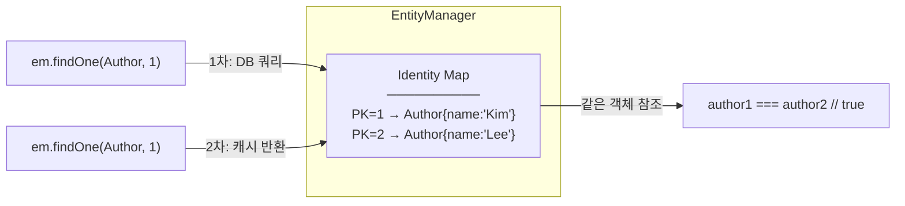
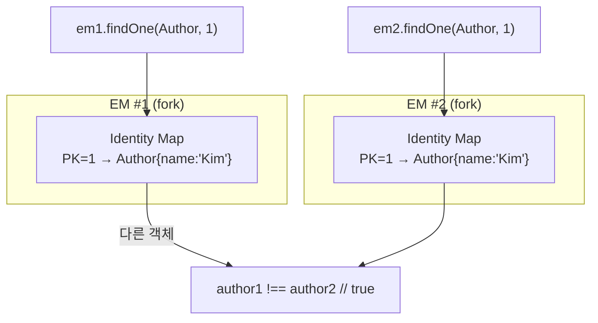

# 07. Identity Map — 1차 캐시

> **핵심 질문**: 같은 PK를 두 번 조회하면 어떻게 되는가?

## 7.1 Identity Map이란?

EM 내부의 **PK → 엔티티 객체** 맵이다. 같은 PK를 여러 번 조회해도 **항상 같은 객체 참조**를 반환한다.



```typescript
const em = orm.em.fork();

const a1 = await em.findOne(Author, 1);  // → DB SELECT
const a2 = await em.findOne(Author, 1);  // → Identity Map 반환 (SELECT 없음)

console.log(a1 === a2);  // true — 같은 객체 참조
```

## 7.2 Identity Map의 범위

**각 fork()된 EM은 독립된 Identity Map**을 가진다:



```typescript
const em1 = orm.em.fork();
const em2 = orm.em.fork();

const a1 = await em1.findOne(Author, 1);
const a2 = await em2.findOne(Author, 1);

console.log(a1 === a2);  // false — 다른 EM, 다른 객체
```

## 7.3 Identity Map과 변경 감지의 관계

```
1. findOne(Author, 1)
   → DB에서 SELECT
   → Identity Map에 등록
   → __originalEntityData = { name: 'Kim' }  (스냅샷 저장)

2. author.name = 'Park'
   → 객체만 변경, DB 변경 없음

3. flush()
   → 현재 값과 __originalEntityData 비교
   → name: 'Kim' → 'Park' (변경 감지!)
   → UPDATE authors SET name = 'Park' WHERE id = 1
   → __originalEntityData = { name: 'Park' }  (스냅샷 갱신)
```

## 7.4 nativeUpdate와 Identity Map

`nativeUpdate()`는 Identity Map을 **우회**한다:

```typescript
const em = orm.em.fork();

const author = await em.findOne(Author, 1);
// Identity Map: PK=1 → { name: 'Original' }

await em.nativeUpdate(Author, { id: 1 }, { name: 'NativeChanged' });
// DB에서는 변경됨, 하지만 Identity Map은 모름

const same = await em.findOne(Author, 1);
console.log(same.name);  // 'Original' ← Identity Map에서 반환!
console.log(same === author);  // true

// 새 EM에서 확인하면 DB 값 반환
const verify = orm.em.fork();
const fresh = await verify.findOne(Author, 1);
console.log(fresh.name);  // 'NativeChanged' ✅
```

> **주의**: nativeUpdate/nativeDelete 후 같은 EM에서 조회하면 **오래된 캐시**가 반환된다.

## 7.5 disableIdentityMap

```typescript
// Identity Map에 등록하지 않는 순수 읽기
const authors = await em.find(Author, {}, {
  disableIdentityMap: true
});

// 장점:
// 1. 메모리 절약 (대량 조회 시)
// 2. 수정해도 flush에 영향 없음
// 3. 항상 DB에서 최신 값 반환

// 단점:
// 같은 PK를 다시 조회하면 다른 객체 반환
```

## 7.6 Identity Map 관련 함정

### 함정 1: nativeDelete 후 find

```typescript
await em.nativeDelete(Author, { id: 1 });
const found = await em.findOne(Author, 1);
// → Identity Map에서 반환될 수 있음! (DB에는 없는데)
```

### 함정 2: 다른 프로세스의 변경

```typescript
// 프로세스 A
const author = await em.findOne(Author, 1);  // name = 'Kim'

// 프로세스 B에서 UPDATE authors SET name = 'Lee' WHERE id = 1

const same = await em.findOne(Author, 1);
console.log(same.name);  // 'Kim' ← Identity Map 캐시!
// em.refresh(author) 또는 새 fork()로 해결
```

## 7.7 검증된 동작 (테스트 기반)

| 테스트 | 검증 내용 |
|--------|----------|
| 4-1 | 같은 EM에서 같은 PK 조회 → 같은 객체 참조 |
| 4-2 | fork() 후 같은 PK → 다른 객체 |
| 9-1 | nativeUpdate 후 같은 EM find → Identity Map 캐시 반환 |
| 9-3 | nativeDelete 후 같은 EM find → Identity Map에 남아있음 |
| 11-6 | disableIdentityMap → Identity Map 미등록 확인 |
| 11-7 | disableIdentityMap 엔티티 수정 → flush해도 UPDATE 안 됨 |

---

[← 이전: 06. 비관적 잠금](./06-pessimistic-locking.md) | [다음: 08. Dirty Checking →](./08-dirty-checking.md)
