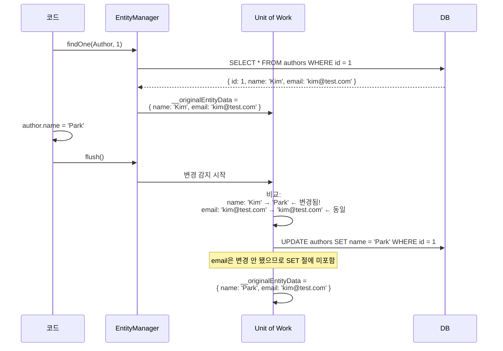

# 08. Dirty Checking — 변경 감지

> **핵심 질문**: UPDATE SQL은 언제, 어떤 기준으로 생성되는가?

## 8.1 Dirty Checking 원리

MikroORM은 엔티티를 DB에서 로드할 때 **원본 스냅샷(`__originalEntityData`)**을 저장한다. `flush()` 시점에 현재 값과 스냅샷을 비교하여 변경된 필드만 UPDATE한다.



## 8.2 변경된 필드만 UPDATE

```typescript
const author = await em.findOne(Author, 1);
// DB: { name: 'Kim', email: 'kim@test.com', age: 30 }

author.name = "Park";
// name만 변경

await em.flush();
// 생성되는 SQL:
// UPDATE `authors` SET `name` = 'Park' WHERE `id` = 1
//
// ❌ 이렇게 안 됨:
// UPDATE `authors` SET `name` = 'Park', `email` = 'kim@test.com', `age` = 30 WHERE `id` = 1
```

## 8.3 변경 없으면 쿼리 없음

```typescript
const author = await em.findOne(Author, 1);
// 아무것도 안 변경

await em.flush();
// → SQL 없음! (변경 감지 결과 차이 없으므로)
```

## 8.4 Dirty Checking vs nativeUpdate

```
┌──────────────────────────────────────────────────────────────┐
│                    Dirty Checking (em.flush)                  │
│                                                              │
│  1. Identity Map에 등록된 엔티티만 대상                         │
│  2. 변경된 필드만 UPDATE                                      │
│  3. __originalEntityData와 비교                               │
│  4. 트랜잭션 안에서 실행                                       │
│  5. 관계 엔티티의 Cascade도 처리                               │
│                                                              │
├──────────────────────────────────────────────────────────────┤
│                    nativeUpdate                               │
│                                                              │
│  1. Identity Map 무시 — 직접 SQL 실행                          │
│  2. 지정한 필드 전체 UPDATE                                    │
│  3. Identity Map과 동기화 안 됨 ⚠️                             │
│  4. 원자적 연산 가능 (raw SQL)                                 │
│  5. Cascade 안 됨                                             │
└──────────────────────────────────────────────────────────────┘
```

```typescript
// nativeUpdate — 원자적 증가 (race condition 안전)
await em.nativeUpdate(Author, { id: 1 }, { age: raw("age + 1") });
// → UPDATE authors SET age = age + 1 WHERE id = 1
// 하지만 Identity Map의 author.age는 여전히 이전 값!
```

## 8.5 em.assign() — 일괄 값 할당

```typescript
const author = await em.findOne(Author, 1);

// 개별 할당
author.name = "Park";
author.email = "park@test.com";

// em.assign() — DTO를 한 번에 할당
em.assign(author, {
  name: "Park",
  email: "park@test.com",
});

await em.flush();
// → 변경된 필드만 UPDATE
```

## 8.6 Dirty Checking이 동작하지 않는 경우

### Case 0: TsMorphMetadataProvider + 외부 패키지 엔티티

**가장 흔하고 진단이 어려운 함정.** `TsMorphMetadataProvider`를 사용할 때, 엔티티의 **부모 클래스가 빌드된 npm 패키지** 안에 있으면 dirty checking이 **조용히 실패**한다.

```
┌─────────────────────────────────────────────────────────────┐
│  @plug-link/commons (빌드된 패키지)                           │
│                                                              │
│  dist/base.entity.d.ts   ← 타입만, 데코레이터 정보 없음        │
│  dist/base.entity.js     ← 런타임 __decorate만               │
│                                                              │
│  @PrimaryKey(), @Property() 메타데이터를 TsMorph이 읽을 수 없음 │
└─────────────────────────────────────────────────────────────┘
         ↑ extends
┌─────────────────────────────────────────────────────────────┐
│  로컬 서비스 (TypeScript 소스)                                │
│                                                              │
│  @Entity()                                                   │
│  class UserEntity extends BaseEntity {                       │
│    @Property() name!: string;                                │
│  }                                                           │
│                                                              │
│  TsMorph이 UserEntity는 읽지만, BaseEntity의                  │
│  id/createdAt/updatedAt 메타데이터를 못 읽음                   │
│  → 엔티티 메타데이터 불완전 → dirty checking 실패               │
└─────────────────────────────────────────────────────────────┘
```

**증상**: `@Transactional()` 안에서 엔티티 필드를 수정해도 UPDATE SQL이 생성되지 않음. 에러도 없이 조용히 무시됨.

**원인**: `TsMorphMetadataProvider`는 **TypeScript 소스 파일**을 파싱하여 `@PrimaryKey()`, `@Property()` 등의 데코레이터를 읽는다. 빌드된 패키지의 `.d.ts`에는 데코레이터 정보가 없고, `.js`에는 `__decorate` 런타임 호출만 있어 TsMorph이 메타데이터를 추출할 수 없다.

**해결 방법**:

| 방법                      | 설명                                                                      |
| ------------------------- | ------------------------------------------------------------------------- |
| 엔티티 소스를 로컬에 유지 | BaseEntity를 패키지가 아닌 로컬 TypeScript 소스로 관리                    |
| 패키지에 소스 포함        | `package.json`의 `files`에 `src/` 추가, TsMorph이 소스 경로를 찾도록 설정 |
| reflect-metadata 사용     | `TsMorphMetadataProvider` 대신 런타임 데코레이터 기반 메타데이터 사용     |

> **실제 사례**: `@plug-link/commons`에서 `BaseEntity`, `BaseRepository`를 빌드된 패키지로 제공했을 때, `@Transactional()` 안에서 dirty checking이 전혀 동작하지 않았다. 동일한 코드를 로컬 TypeScript 소스로 옮기자 즉시 정상 동작. `@Transactional()` 데코레이터나 `TransactionalExplorer`는 패키지에서 import해도 문제없었다 — **엔티티 메타데이터만** 영향을 받는다.

### Case 1: disableIdentityMap으로 조회

```typescript
const [author] = await em.find(Author, {}, { disableIdentityMap: true });
author.name = "Changed";
await em.flush();
// → UPDATE 없음 (Identity Map에 없으므로 추적 안 됨)
```

### Case 2: em.merge()의 함정

```typescript
const em2 = orm.em.fork();
em2.merge(detachedEntity);
// → __originalEntityData가 현재 값으로 설정됨
// → 변경 감지 시 "차이 없음" → UPDATE 안 됨!
// → em.upsert()를 사용해야 함
```

### Case 3: 참조 타입 변경

```typescript
// 주의: 배열/객체의 내부 변경은 감지 안 될 수 있음
// MikroORM의 JSON 필드에서 주의 필요
entity.jsonField.nested.value = "changed";
// → 참조가 동일하므로 변경 감지 안 될 수 있음

// 해결: 새 객체로 할당
entity.jsonField = { ...entity.jsonField, nested: { value: "changed" } };
```

## 8.7 검증된 동작 (테스트 기반)

| 테스트 | 검증 내용                                    |
| ------ | -------------------------------------------- |
| 5-1    | 필드 변경 → flush → UPDATE                   |
| 5-2    | 같은 값으로 할당 → flush → 쿼리 없음         |
| 5-3    | 여러 필드 변경 → flush → UPDATE 1회          |
| 5-4    | 필드 변경 → persist 없이 flush → UPDATE 실행 |
| 9-1    | nativeUpdate → Identity Map과 불일치         |
| 12-3   | save(변경 없는 엔티티) → 쿼리 없음           |

---

[← 이전: 07. Identity Map](./07-identity-map.md) | [다음: 09. 연관관계 →](./09-relations.md)
