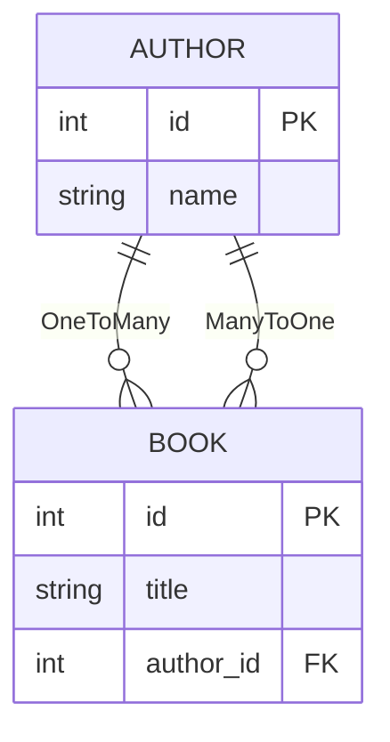
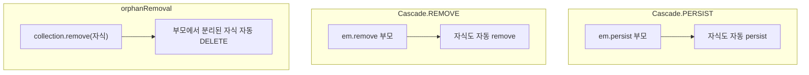

# 09. 연관관계 (Relations)

> **핵심 질문**: Cascade와 orphanRemoval은 어떻게 동작하는가?

## 9.1 관계 타입



```typescript
// Author 엔티티 (부모)
@Entity()
class Author {
  @PrimaryKey()
  id!: number;

  @OneToMany(() => Book, book => book.author, {
    cascade: [Cascade.PERSIST, Cascade.REMOVE],
    orphanRemoval: true,
  })
  books = new Collection<Book>(this);
}

// Book 엔티티 (자식)
@Entity()
class Book {
  @PrimaryKey()
  id!: number;

  @ManyToOne(() => Author)
  author!: Author;
}
```

## 9.2 Cascade 옵션



| 옵션 | 동작 | SQL |
|------|------|-----|
| `Cascade.PERSIST` | 부모 persist 시 자식도 자동 persist | INSERT 부모 → INSERT 자식 |
| `Cascade.REMOVE` | 부모 remove 시 자식도 자동 remove | DELETE 자식 → DELETE 부모 |
| `orphanRemoval` | 컬렉션에서 제거된 자식 자동 삭제 | DELETE 자식 |

### Cascade.PERSIST 동작

```typescript
const author = em.create(Author, { name: 'Kim' });
const book = em.create(Book, { title: 'ORM Guide', author });
author.books.add(book);

em.persist(author);  // ← book도 자동 persist
await em.flush();
// → INSERT INTO authors (name) VALUES ('Kim')
// → INSERT INTO books (title, author_id) VALUES ('ORM Guide', 1)
```

### Cascade.REMOVE 동작

```typescript
const author = await em.findOneOrFail(Author, 1, { populate: ['books'] });
em.remove(author);  // ← books도 자동 remove
await em.flush();
// → DELETE FROM books WHERE author_id = 1
// → DELETE FROM authors WHERE id = 1
```

### orphanRemoval 동작

```typescript
const author = await em.findOneOrFail(Author, 1, { populate: ['books'] });

// 컬렉션에서 제거 → orphanRemoval로 자동 DELETE
author.books.remove(author.books[0]);
await em.flush();
// → DELETE FROM books WHERE id = ?

// 컬렉션 전체 비우기
author.books.removeAll();
await em.flush();
// → DELETE FROM books WHERE author_id = 1
```

## 9.3 Collection API

```typescript
const author = await em.findOneOrFail(Author, 1, { populate: ['books'] });

// 초기화 확인
author.books.isInitialized();  // true (populate로 로드됨)

// 개수
author.books.count();  // 3

// 추가
author.books.add(newBook);

// 제거 (orphanRemoval 시 DELETE)
author.books.remove(book);

// 전체 제거
author.books.removeAll();

// 순회
for (const book of author.books) { /* ... */ }

// 배열로 변환
const arr = author.books.getItems();
```

## 9.4 Lazy Loading vs Eager Loading — Spring과의 결정적 차이

### Spring Hibernate: 프록시 자동 로딩

```java
// Spring — @ManyToOne(fetch = LAZY)
Author author = em.find(Author.class, 1);
// author는 프록시 객체
author.getName();  // ← 이 시점에 자동으로 SELECT 실행 (Hibernate 프록시)
author.getBooks(); // ← Collection도 접근 시 자동 SELECT

// 개발자가 명시적으로 로드를 호출할 필요 없음
```

### MikroORM: 명시적 로딩 필수

```typescript
// MikroORM — Lazy가 기본이지만, 자동 로딩하지 않음
const author = await em.findOne(Author, 1);

// ❌ Collection 접근 시 에러 (자동 SELECT 없음)
author.books.getItems();  // → Error: Collection not initialized

// ✅ 방법 1: Collection.init() — 명시적 Lazy Loading
await author.books.init();  // 이 시점에 SELECT
author.books.getItems();    // 정상

// ✅ 방법 2: populate — Eager Loading
const author = await em.findOne(Author, 1, {
  populate: ['books'],  // JOIN 또는 별도 SELECT로 로드
});
author.books.getItems();  // 이미 로드됨
```

### ManyToOne Reference — PK만 접근 가능

```typescript
// book만 조회 (author populate 없이)
const book = await em.findOne(Book, 1);

// ManyToOne은 Reference — PK는 접근 가능
book.author.id;    // ✅ FK 값이므로 추가 쿼리 없이 사용 가능
book.author.name;  // ❌ undefined — 로드되지 않은 프로퍼티

// Spring이라면 book.getAuthor().getName() 시 자동 SELECT
// MikroORM은 populate이나 load()로 명시적 로딩 필요
```

### 비교 요약

| 동작 | Spring Hibernate | MikroORM |
|------|-----------------|----------|
| Collection 접근 | 프록시가 자동 SELECT | **에러** (`not initialized`) |
| `Collection.init()` | 해당 없음 | 명시적 Lazy Loading |
| `populate` | `fetch = EAGER` / `@EntityGraph` | `{ populate: ['books'] }` |
| ManyToOne PK | 자동 접근 가능 | FK이므로 접근 가능 |
| ManyToOne 다른 필드 | 프록시가 자동 SELECT | **undefined** (로드 필요) |

> **핵심 차이**: Spring Hibernate는 프록시 객체를 통해 프로퍼티 접근 시 자동으로 SELECT를 실행한다.
> MikroORM은 이런 프록시 메커니즘이 없으므로, `populate` 또는 `Collection.init()`으로 명시적 로딩이 필수다.

## 9.5 관계 + 트랜잭션

```typescript
// Cascade.PERSIST + @Transactional → 자동 처리
@Transactional()
async createAuthorWithBooks(name: string, titles: string[]) {
  const author = this.em.create(Author, { name });

  for (const title of titles) {
    const book = this.em.create(Book, { title, author });
    author.books.add(book);
  }

  // persist 불필요 (em.create가 자동 persist)
  // flush 불필요 (@Transactional이 자동 flush)
  return author;
}
```

## 9.6 검증된 동작 (테스트 기반)

| 테스트 | 검증 내용 |
|--------|----------|
| 7-1 | 부모 + 자식 함께 persist → flush → 둘 다 INSERT |
| 7-2 | 부모만 persist + cascade PERSIST → 자식도 INSERT |
| 7-3 | 부모 조회 → 자식 컬렉션에서 제거 (orphanRemoval 동작 확인) |
| 7-5 | 자식만 persist (부모 이미 managed) → 자식 INSERT |
| 7-6 | 부모 remove + cascade REMOVE → 자식도 삭제 |
| 7-8 | populate 없이 Collection 접근 → 에러 (Spring과 다름: 자동 로딩 안 됨) |
| 7-9 | Collection.init() → 명시적 Lazy Loading |
| 7-10 | populate으로 Eager Loading → 즉시 사용 가능 |
| 7-11 | ManyToOne Reference — PK만 접근 가능, 나머지는 undefined |
| 13-5 | save(유저 + posts) → Cascade.PERSIST로 관련 엔티티 함께 저장 |

---

[← 이전: 08. Dirty Checking](./08-dirty-checking.md) | [다음: 10. 벌크 연산 →](./10-bulk-operations.md)
