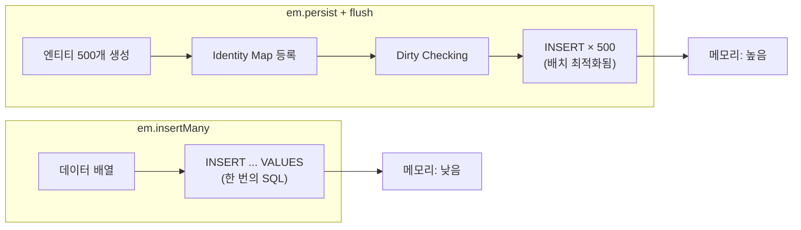
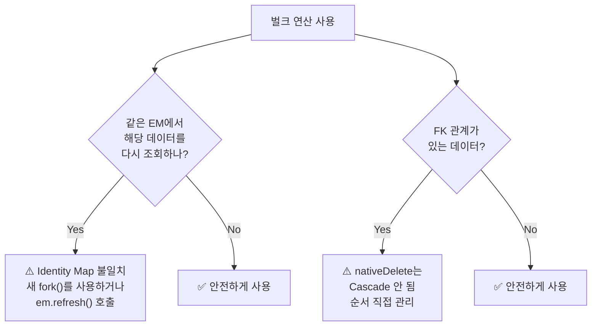

# 10. 벌크 연산

> **핵심 질문**: insertMany와 nativeUpdate는 EM을 어떻게 우회하는가?

## 10.1 벌크 연산의 필요성

EM(Identity Map + Dirty Checking)은 **객체 단위** 작업에 최적화되어 있다. 대량 데이터 처리 시에는 EM을 우회하는 벌크 연산이 더 효율적이다.

```
┌───────────────────────────────────────────────────┐
│ EM 경유 (em.persist + flush)                       │
│   - 엔티티 객체 생성                                │
│   - Identity Map 등록                              │
│   - Dirty Checking                                 │
│   - Cascade 처리                                   │
│   → 메모리 사용 높음, 유연함                          │
│                                                    │
│ EM 우회 (insertMany, nativeUpdate, nativeDelete)    │
│   - 직접 SQL 실행                                   │
│   - Identity Map 미등록/미동기화                      │
│   - Cascade 없음                                    │
│   → 메모리 사용 낮음, 빠름                            │
└───────────────────────────────────────────────────┘
```

## 10.2 insertMany()

대량 INSERT에 최적화된 메서드. Identity Map에 등록하지 않는다.

```typescript
// 500건 INSERT
await em.insertMany(Author, [
  { name: 'Author 1' },
  { name: 'Author 2' },
  // ... 500건
]);
// → INSERT INTO authors (name) VALUES ('Author 1'), ('Author 2'), ...
// → Identity Map에는 미등록!
```



### insertMany 후 조회

```typescript
await em.insertMany(Author, [{ name: 'Bulk' }]);

// 같은 EM에서 find
const found = await em.find(Author, { name: 'Bulk' });
// → DB SELECT 실행 → Identity Map에 새로 등록
// → found[0]은 insertMany의 객체와 다른 인스턴스
```

## 10.3 nativeUpdate()

Identity Map을 **우회**하여 직접 UPDATE SQL 실행:

```typescript
// 일반 UPDATE (EM 경유)
const author = await em.findOne(Author, 1);
author.name = 'Changed';
await em.flush();
// → UPDATE authors SET name = 'Changed' WHERE id = 1

// nativeUpdate (EM 우회)
await em.nativeUpdate(Author, { id: 1 }, { name: 'Changed' });
// → 같은 SQL이지만 Identity Map과 동기화 안 됨
```

### 원자적 증가 (Race Condition 방지)

```typescript
import { raw } from '@mikro-orm/core';

// ❌ 위험 — read-modify-write (Race Condition)
const author = await em.findOne(Author, 1);
author.age = author.age + 1;
await em.flush();

// ✅ 안전 — 원자적 증가
await em.nativeUpdate(
  Author,
  { id: 1 },
  { age: raw('age + 1') },
);
// → UPDATE authors SET age = age + 1 WHERE id = 1
```

## 10.4 nativeDelete()

```typescript
// EM 경유 삭제
const author = await em.findOne(Author, 1);
em.remove(author);
await em.flush();
// → Cascade.REMOVE 처리
// → DELETE FROM books WHERE author_id = 1
// → DELETE FROM authors WHERE id = 1

// nativeDelete — Cascade 없음!
await em.nativeDelete(Author, { id: 1 });
// → DELETE FROM authors WHERE id = 1
// → FK 제약 조건에 걸릴 수 있음 (자식이 있으면)
```

## 10.5 주의사항 요약



| 연산 | Identity Map | Cascade | 트랜잭션 | 용도 |
|------|-------------|---------|---------|------|
| `em.persist + flush` | 등록 | 처리 | 자동 | 일반 작업 |
| `em.insertMany` | 미등록 | 없음 | 참여 | 대량 INSERT |
| `em.nativeUpdate` | 미동기화 | 없음 | 참여 | 원자적 UPDATE |
| `em.nativeDelete` | 미동기화 | 없음 | 참여 | 단순 DELETE |

## 10.6 검증된 동작 (테스트 기반)

| 테스트 | 검증 내용 |
|--------|----------|
| 10-1 | insertMany → DB INSERT, Identity Map 미등록 |
| 10-2 | insertMany 후 find → DB에서 새로 Identity Map 등록 |
| 10-3 | @Transactional 안에서 insertMany → 예외 시 rollback |
| 10-4 | 500건 chunk insertMany → 모두 정상 INSERT |
| 9-1 | nativeUpdate → Identity Map 캐시와 불일치 |
| 9-2 | nativeUpdate + raw() 원자적 증가 |
| 9-3 | nativeDelete → Identity Map에 남아있을 수 있음 |
| 9-4 | @Transactional 안에서 nativeUpdate → 예외 시 rollback |

---

[← 이전: 09. 연관관계](./09-relations.md) | [다음: 11. TransactionalExplorer →](./11-transactional-explorer.md)
