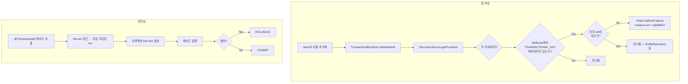
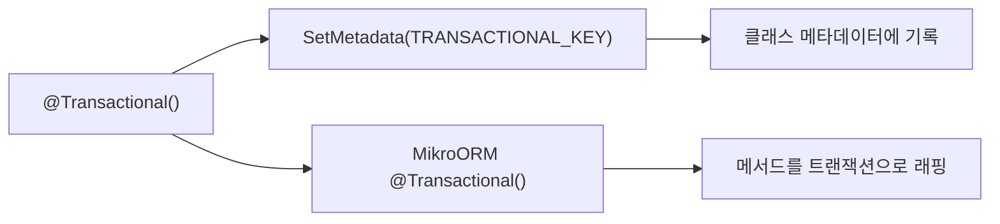
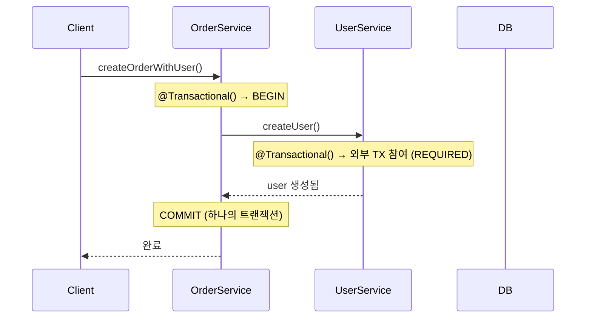

# 11. TransactionalExplorer — em 자동 주입

> **핵심 질문**: em을 매번 주입하지 않고도 @Transactional()을 쓸 수 있는가?

## 11.1 문제 상황

MikroORM v7의 `@Transactional()` 데코레이터는 내부적으로 `this.em` 또는 `this.orm` 프로퍼티에 접근하여 트랜잭션을 생성한다. 그런데 Spring JPA처럼 서비스 클래스에서 `@Transactional()`만 붙이면 자동으로 동작할까?

```typescript
// ❌ 동작 안 함 — this.em이 없음
@Injectable()
class UserService {
  constructor(private readonly userRepo: UserRepository) {}

  @Transactional()
  async createUser(name: string) {
    // Error: Cannot read properties of undefined (reading 'getContext')
    // → this.em이 없기 때문
  }
}
```

```
┌───────────────────────────────────────────────────────┐
│ Spring JPA                                             │
│   @Transactional → AOP Proxy가 자동으로                │
│   EntityManager를 ThreadLocal에서 가져옴               │
│                                                        │
│ MikroORM                                               │
│   @Transactional → this.em이 반드시 있어야 함           │
│   EntityRepository는 자동으로 em이 있지만               │
│   일반 서비스 클래스에는 없음                            │
└───────────────────────────────────────────────────────┘
```

## 11.2 해결 방법 — TransactionalExplorer

NestJS의 `DiscoveryService` + `Reflector`를 활용해 `@Transactional()` 데코레이터를 사용하는 프로바이더에만 `em`을 자동 주입한다.

### 전체 아키텍처



### Step 1: 커스텀 @Transactional() 래퍼 데코레이터

```typescript
import { SetMetadata } from '@nestjs/common';
import { Transactional as MikroTransactional } from '@mikro-orm/decorators/legacy';
import type { TransactionOptions } from '@mikro-orm/core';

// 식별용 메타데이터 키
export const TRANSACTIONAL_KEY = Symbol('TRANSACTIONAL');

export function Transactional(options?: TransactionOptions): MethodDecorator {
  return (target, propertyKey, descriptor) => {
    // 1) 클래스에 메타데이터 마킹 (Reflector가 읽을 수 있도록)
    SetMetadata(TRANSACTIONAL_KEY, true)(target.constructor);

    // 2) 원본 MikroORM @Transactional() 적용
    return MikroTransactional(options)(target, propertyKey, descriptor);
  };
}
```



> **핵심**: `SetMetadata`는 **클래스**(prototype.constructor)에 붙이고, 원본 `@Transactional()`은 **메서드**에 적용한다.

### Step 2: TransactionalExplorer

```typescript
@Injectable()
export class TransactionalExplorer implements OnModuleInit {
  constructor(
    private readonly discoveryService: DiscoveryService,
    private readonly reflector: Reflector,
    private readonly em: EntityManager,
  ) {}

  onModuleInit(): void {
    const providers = this.discoveryService.getProviders();

    for (const wrapper of providers) {
      const { instance } = wrapper;
      if (!instance || typeof instance !== 'object') continue;

      // 이미 em이 있으면 건너뜀 (EntityRepository, 직접 주입 등)
      if ((instance as any).em) continue;

      // Reflector로 TRANSACTIONAL_KEY 메타데이터 확인
      const hasTransactional = this.reflector.get(
        TRANSACTIONAL_KEY,
        instance.constructor,
      );
      if (!hasTransactional) continue;

      // em 주입
      Object.defineProperty(instance, 'em', {
        value: this.em,
        writable: false,
        enumerable: false,
        configurable: true,
      });
    }
  }
}
```

### Step 3: 모듈 등록

```typescript
import { Module } from '@nestjs/common';
import { DiscoveryModule } from '@nestjs/core';
import { TransactionalExplorer } from './transactional.explorer';

@Module({
  imports: [
    MikroOrmModule.forRoot({ /* ... */ }),
    DiscoveryModule,  // ← DiscoveryService 사용에 필요
  ],
  providers: [
    TransactionalExplorer,
    UserService,
    OrderService,
  ],
})
export class AppModule {}
```

## 11.3 사용 예시

```typescript
// em 주입 없이 @Transactional() 사용 가능
@Injectable()
class UserService {
  constructor(private readonly userRepo: UserRepository) {}

  // ✅ Explorer가 자동으로 this.em을 주입해줌
  @Transactional()
  async createUser(name: string): Promise<UserEntity> {
    return this.userRepo.create({ name });
  }

  // ✅ 예외 시 rollback도 정상 동작
  @Transactional()
  async createUserAndThrow(name: string): Promise<void> {
    this.userRepo.create({ name });
    throw new Error('Rollback test');
  }
}
```

## 11.4 서비스 간 트랜잭션 전파



```typescript
@Injectable()
class OrderService {
  constructor(private readonly userService: UserService) {}

  // Outer @Transactional → Inner @Transactional (UserService)
  @Transactional()
  async createOrderWithUser(userName: string): Promise<void> {
    await this.userService.createUser(userName);
    // 추가 작업...
  }

  // Inner 예외 → 전체 rollback
  @Transactional()
  async createOrderWithUserThrow(userName: string): Promise<void> {
    this.userRepo.create({ name: 'Order Owner' });
    await this.userService.createUserAndThrow(userName);
    // → Error → 전체 rollback (Order Owner도 롤백)
  }
}
```

## 11.5 ESLint로 원본 import 차단

커스텀 래퍼를 만들었으면, 실수로 원본 `@Transactional()`을 직접 import하는 것을 막아야 한다:

```javascript
// eslint.config.mjs
{
  rules: {
    'no-restricted-imports': ['error', {
      paths: [{
        name: '@mikro-orm/decorators/legacy',
        importNames: ['Transactional'],
        message: '@Transactional()은 커스텀 래퍼 데코레이터를 사용하세요. (TransactionalExplorer 자동 em 주입 필요)',
      }],
    }],
  }
}
```

```typescript
// ❌ ESLint 에러
import { Transactional } from '@mikro-orm/decorators/legacy';

// ✅ 허용
import { Transactional } from './transactional.decorator';

// ✅ 래퍼 데코레이터 파일에서만 eslint-disable로 원본 허용
// eslint-disable-next-line no-restricted-imports -- 래퍼에서만 원본 직접 참조
import { Transactional as MikroTransactional } from '@mikro-orm/decorators/legacy';
```

## 11.6 선택적 주입이 중요한 이유

초기 버전에서는 **모든 프로바이더**에 em을 주입했다. 이것은 위험하다:

```
❌ 전체 주입 — 위험
  - HttpAdapterHost → em 주입 → getter 충돌 → 크래시
  - 모든 프로바이더에 불필요한 프로퍼티 추가
  - 의도치 않은 side effect

✅ 선택적 주입 (Reflector 기반) — 안전
  - @Transactional()을 사용하는 클래스만 대상
  - NestJS 내장 프로바이더는 건너뜀
  - 명시적 의도: "이 클래스는 트랜잭션이 필요하다"
```

## 11.7 검증된 동작 (테스트 기반)

| 테스트 | 검증 내용 |
|--------|----------|
| 11-1 | em 미주입 서비스에서 @Transactional() → Explorer가 em 자동 주입 → 정상 동작 |
| 11-2 | em 미주입 서비스 @Transactional() 예외 → rollback |
| 11-3 | 서비스 간 @Transactional() 전파 — Outer → Inner 정상 |
| 11-4 | 서비스 간 @Transactional() 전파 — Inner 예외 → 전체 rollback |
| 11-5 | Explorer 주입된 em이 실제 글로벌 EM 프록시인지 확인 |

---

[← 이전: 10. 벌크 연산](./10-bulk-operations.md) | [다음: 12. BaseRepository →](./12-base-repository.md)
