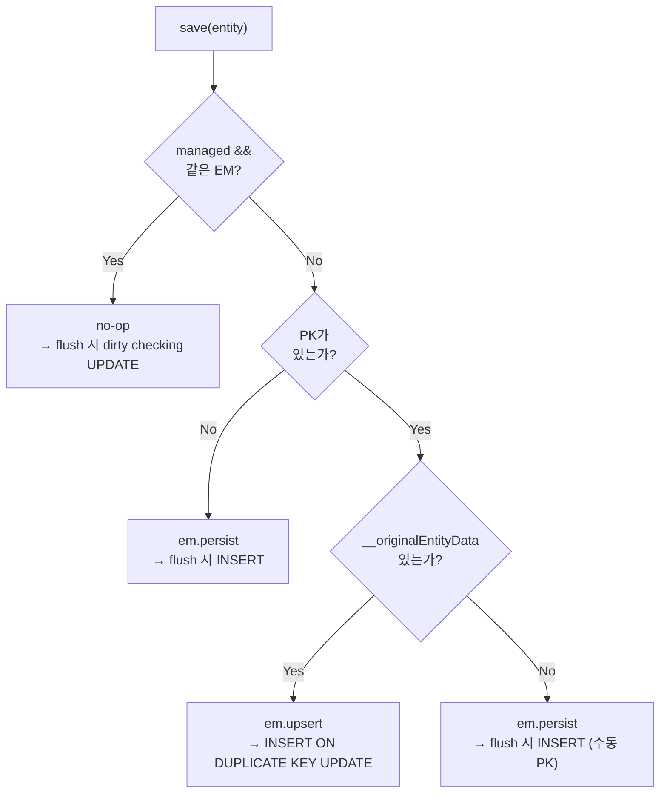
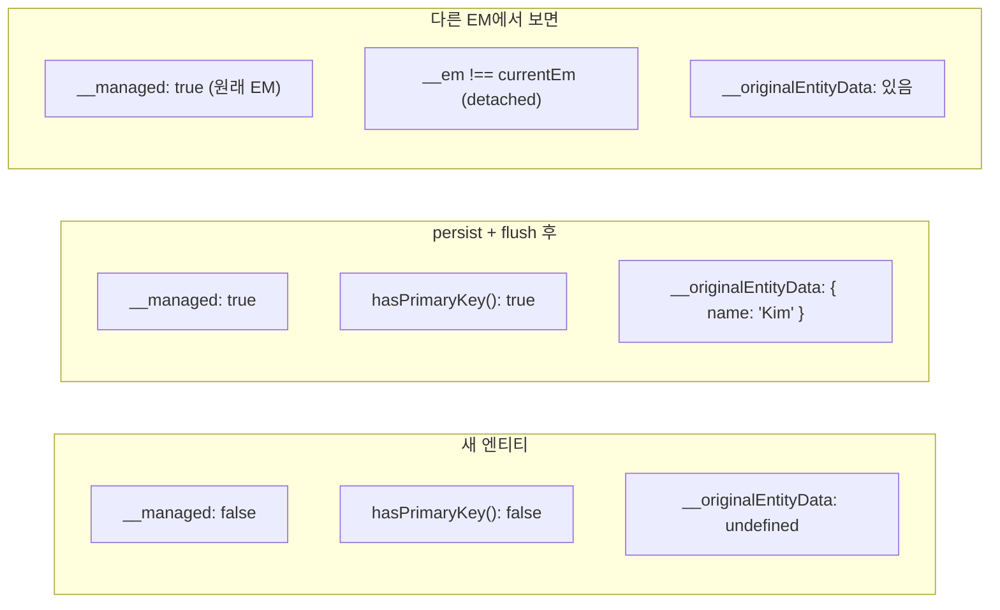
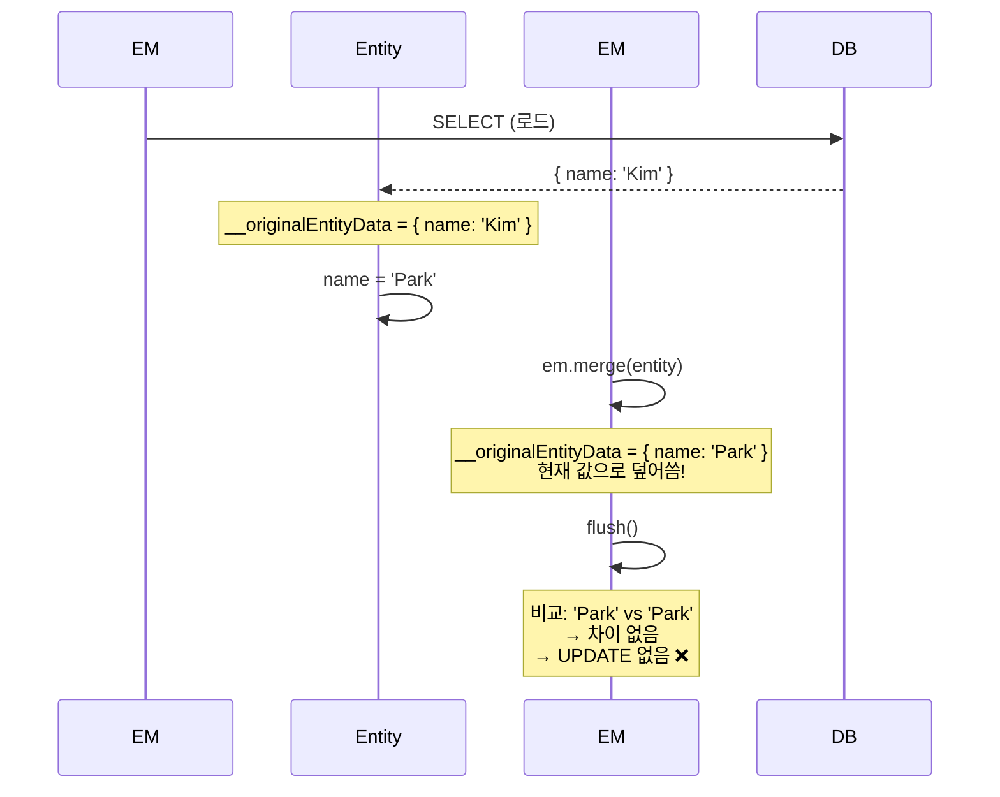
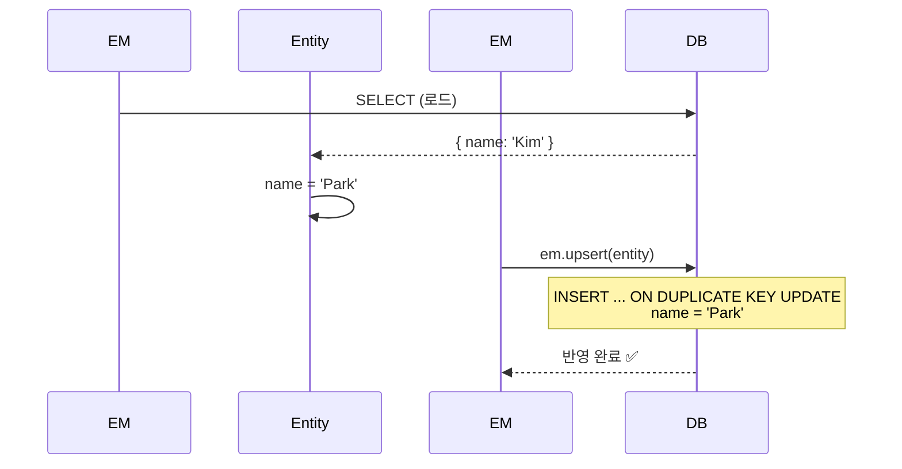
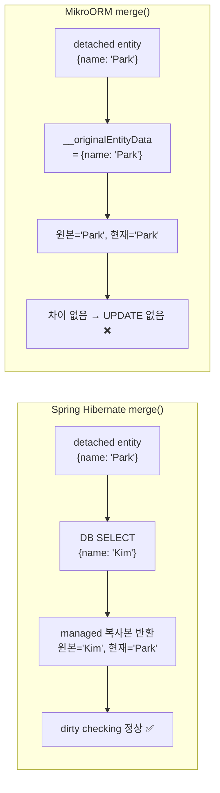
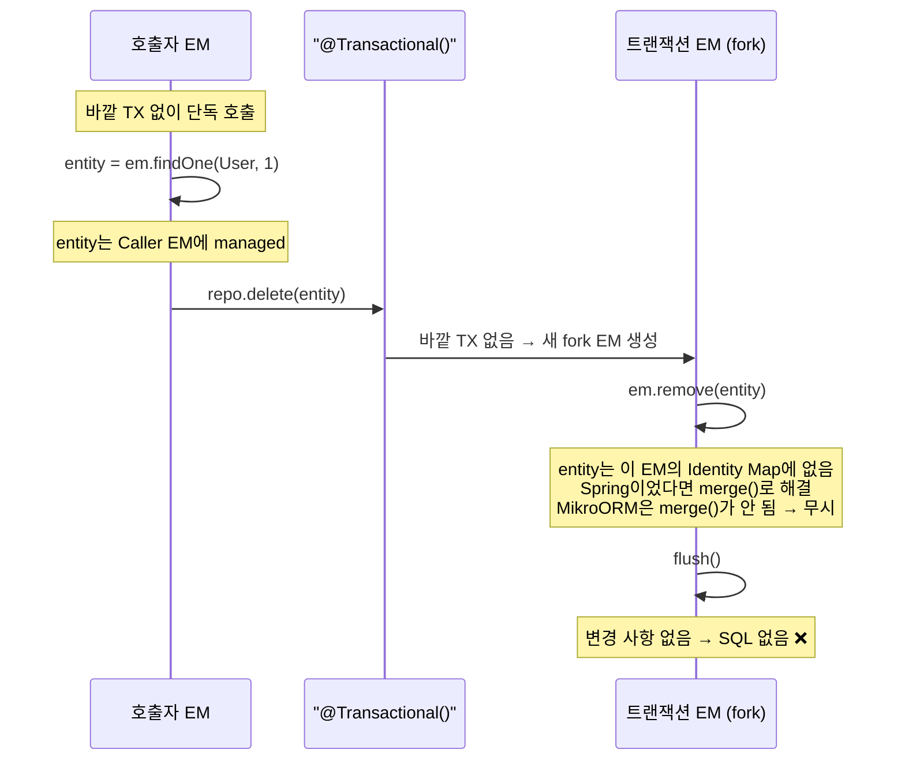

# 12. BaseRepository — JPA-like 레포지토리

> **핵심 질문**: JPA의 save()처럼 INSERT/UPDATE를 자동 판단할 수 있는가?

## 12.1 Spring JPA Repository와의 비교

```
┌───────────────────────────────────────────────────────┐
│ Spring JPA — JpaRepository                             │
│                                                        │
│   save(entity)     → INSERT or UPDATE (자동 판단)       │
│   saveAll(entities) → 배치 save                         │
│   findById(id)     → Optional<T>                       │
│   existsById(id)   → boolean                           │
│   deleteById(id)   → void                              │
│   delete(entity)   → void                              │
│                                                        │
├───────────────────────────────────────────────────────┤
│ MikroORM — EntityRepository                            │
│                                                        │
│   ❌ save()가 없음                                      │
│   em.persist(entity) → INSERT                          │
│   em.flush()          → dirty checking UPDATE          │
│   em.remove(entity)   → DELETE                         │
│   findOne(filter)     → T | null                       │
│   count(filter)       → number                         │
│                                                        │
│   → 상태 판단을 개발자가 직접 해야 함                    │
└───────────────────────────────────────────────────────┘
```

## 12.2 BaseRepository 설계

### save() — 엔티티 상태 자동 판단



### 엔티티 상태별 동작

| 상태 | 판단 기준 | 동작 | SQL |
|------|----------|------|-----|
| New (PK 없음) | `!hasPrimaryKey()` | `em.persist` | INSERT |
| New (수동 PK) | PK 있음 + `__originalEntityData` 없음 | `em.persist` | INSERT |
| Managed | `__managed && __em === em` | no-op | UPDATE (dirty checking) |
| Detached | `__originalEntityData` 있음 + 다른 EM | `em.upsert` | INSERT ON DUPLICATE KEY UPDATE |

### 구현 코드

```typescript
export class BaseRepository<T extends object> extends EntityRepository<T> {

  @Transactional()
  async save(entity: T): Promise<T> {
    const em = this.em;
    const wrapped = helper(entity);

    // Case 1: Managed — dirty checking에 맡김
    if (wrapped.__managed && wrapped.__em === em) {
      return entity;
    }

    // Case 2: New — PK 없음
    if (!wrapped.hasPrimaryKey()) {
      em.persist(entity);
      return entity;
    }

    // Case 3: Detached — DB에서 로드된 적 있음
    if (wrapped.__originalEntityData) {
      return await em.upsert(this.entityName, entity as any) as T;
    }

    // Case 4: New — 수동 PK
    em.persist(entity);
    return entity;
  }
}
```

## 12.3 helper() / wrap() API — 엔티티 상태 판별

`save()`의 핵심은 엔티티 상태를 정확히 판별하는 것이다. MikroORM은 엔티티 내부 상태에 접근하는 두 가지 API를 제공한다:

- `wrap(entity)` — 공식 문서에서 권장하는 **공개 API**. `WrappedEntity`를 반환.
- `helper(entity)` — 내부 구현용 API로, `wrap()`보다 더 많은 내부 프로퍼티에 접근 가능. 본 프로젝트에서는 `__managed`, `__em` 등 내부 상태가 필요하여 `helper()`를 사용했다.

```typescript
import { helper, wrap } from '@mikro-orm/core';

const wrapped = helper(entity);

wrapped.__managed         // boolean — EM에 의해 관리 중인가?
wrapped.__em              // EntityManager | undefined — 어느 EM에 속하는가?
wrapped.hasPrimaryKey()   // boolean — PK가 할당되었는가?
wrapped.__originalEntityData  // object | undefined — DB에서 로드된 원본 스냅샷
```



## 12.4 em.merge() vs em.upsert() — Detached 엔티티 처리

### em.merge()의 함정



### em.upsert()로 해결



```typescript
// ❌ merge — dirty checking이 동작하지 않음
em2.merge(detachedEntity);
await em2.flush();  // → UPDATE 없음!

// ✅ upsert — 직접 DB에 반영
await em2.upsert(UserEntity, detachedEntity);  // → UPDATE 실행
```

## 12.5 delete()에 @Transactional()을 붙이지 않은 이유

### Spring은 왜 문제가 없는가 — merge()의 차이

Spring의 `SimpleJpaRepository.delete()`는 detached 엔티티를 받아도 정상 동작한다:

```java
// Spring Data JPA — SimpleJpaRepository.delete()
@Transactional
public void delete(T entity) {
    if (entityInformation.isNew(entity)) return;

    // detached면 merge로 managed 상태로 복원
    T existing = em.contains(entity)
        ? entity
        : em.merge(entity);  // ← DB SELECT → managed 복사본 반환

    em.remove(existing);
}
```

Hibernate의 `merge()`는 DB에서 현재 상태를 읽어 managed 복사본을 반환한다. 그래서 어느 EM에서 호출하든, detached 엔티티를 넘겨도 문제없다.

**MikroORM의 `merge()`는 다르게 동작한다**:

| | Spring Hibernate `merge()` | MikroORM `merge()` |
|---|---|---|
| 동작 | DB SELECT → managed 복사본 반환 | `__originalEntityData`를 **현재 값으로 덮어씀** |
| dirty checking | 정상 (DB 원본 vs 현재 값 비교) | **불가** (원본 = 현재 → 차이 없음) |
| detached → remove | merge → managed → remove 정상 | merge해도 dirty checking 안 됨 |



### MikroORM에서의 문제

`merge()`가 Spring처럼 동작했다면 `@Transactional()`을 붙여도 문제없었다. `merge()`의 구현 차이가 근본 원인이다.

`@Transactional()`은 REQUIRED 전파이므로 **바깥 TX가 있으면 참여**한다:

| 호출 상황 | @Transactional() 동작 | delete 결과 |
|----------|---------------------|------------|
| 바깥 TX **있음** | 참여 → 같은 EM | entity managed → **정상** |
| 바깥 TX **없음** | 새 fork EM 생성 | entity는 다른 EM 소속, merge도 안 됨 → **remove 무시** |

바깥 TX가 있으면 정상이지만, **단독 호출 시 조용히 실패**한다:



### 설계 결정: @Transactional() 제거

```typescript
// @Transactional() 제거 → this.em은 프록시로 caller의 컨텍스트 EM에 위임
// entity가 속한 EM과 동일 → remove 정상 동작
async delete(entity: T): Promise<void> {
  this.em.remove(entity);
  await this.em.flush();
}
```

`@Transactional()`을 제거하면 `this.em`이 프록시를 통해 caller의 컨텍스트 EM에 위임된다. entity가 속한 EM과 동일하므로 remove가 정상 동작하고, 바깥 컨텍스트가 없으면 `allowGlobalContext: false`에 의한 명확한 에러가 발생한다.

> **deleteById()는 사정이 다르다**: 내부에서 `findOneOrFail`로 엔티티를 직접 로드하므로, 어떤 EM에서 실행되든 entity가 항상 해당 EM에 managed 상태다. merge가 필요 없다.

## 12.6 saveAll() — 혼합 상태 일괄 처리

```typescript
@Transactional()
async saveAll(entities: T[]): Promise<T[]> {
  return Promise.all(entities.map(async (entity) => {
    const wrapped = helper(entity);

    if (wrapped.__managed && wrapped.__em === this.em) return entity;

    if (!wrapped.hasPrimaryKey()) {
      this.em.persist(entity);
      return entity;
    }

    if (wrapped.__originalEntityData) {
      return await this.em.upsert(this.entityName, entity as any) as T;
    }

    this.em.persist(entity);
    return entity;
  }));
}
```

> **주의**: `upsert()`는 async이므로 `Promise.all` + `async map`이 필수. 일반 `map`을 쓰면 `Promise<T>[]`가 반환되어 타입 에러.

## 12.7 전체 BaseRepository API

```typescript
export class BaseRepository<T extends object> extends EntityRepository<T> {

  // === Create / Update ===
  save(entity: T): Promise<T>         // 상태 자동 판단 INSERT/UPDATE
  saveAll(entities: T[]): Promise<T[]> // 배치 save

  // === Read ===
  findById(id: Primary<T>): Promise<T | null>   // findOne 래퍼
  findByIdOrFail(id: Primary<T>): Promise<T>    // 없으면 에러
  existsById(id: Primary<T>): Promise<boolean>  // 존재 여부

  // === Delete ===
  deleteById(id: Primary<T>): Promise<void>       // ID로 삭제 (내부 조회 후 remove)
  delete(entity: T): Promise<void>                 // 엔티티 직접 삭제
  deleteAll(entities: T[]): Promise<void>           // 여러 엔티티를 한 번의 flush로 삭제
  deleteAllByIds(ids: Primary<T>[]): Promise<number> // ID 배열로 벌크 삭제 (단일 쿼리)
}
```

| 메서드 | Spring JPA | MikroORM BaseRepository | 트랜잭션 |
|--------|-----------|------------------------|---------|
| `save()` | `JpaRepository.save()` | `@Transactional` + helper 판별 | 자체 TX |
| `saveAll()` | `JpaRepository.saveAll()` | `Promise.all` + 개별 save 로직 | 자체 TX |
| `findById()` | `JpaRepository.findById()` | `findOne(id)` | 없음 |
| `deleteById()` | `JpaRepository.deleteById()` | `findOneOrFail` + `remove` + `flush` | flush TX |
| `delete()` | `JpaRepository.delete()` | `remove` + `flush` | flush TX |
| `deleteAll()` | `JpaRepository.deleteAll()` | N번 `remove` + 1번 `flush` | flush TX |
| `deleteAllByIds()` | `JpaRepository.deleteAllById()` | `nativeDelete` + `$in` | 단일 쿼리 |

### deleteAll() vs deleteAllByIds()

```typescript
// deleteAll — 엔티티를 받아서 N번 remove + 1번 flush
// Identity Map과 동기화됨 (remove이므로 managed 상태 변경)
await repo.deleteAll([user1, user2]);

// deleteAllByIds — ID만 받아서 단일 DELETE WHERE id IN (...) 쿼리
// 더 효율적이지만 Identity Map과 동기화되지 않음
const deletedCount = await repo.deleteAllByIds([1, 2, 3]);
```

| 메서드 | 쿼리 수 | Identity Map 동기화 | 적합한 상황 |
|--------|---------|-------------------|-----------|
| `delete()` | N번 (건별 flush) | ✅ | 단건 삭제 |
| `deleteAll()` | 1번 (배치 flush) | ✅ | 엔티티가 이미 로드된 경우 |
| `deleteAllByIds()` | 1번 (단일 쿼리) | ❌ | ID만 있고, 이후 EM을 사용하지 않는 경우 |

## 12.8 커스텀 레포지토리 확장

```typescript
// BaseRepository를 상속하여 도메인 메서드 추가
export class UserRepository extends BaseRepository<UserEntity> {

  async findByName(name: string): Promise<UserEntity | null> {
    return this.findOne({ name } as any);
  }

  async findActiveUsers(): Promise<UserEntity[]> {
    return this.find({ active: true } as any);
  }
}
```

엔티티에 `customRepository`를 지정:

```typescript
@Entity({ tableName: 'jpa_users', repository: () => UserRepository })
export class UserEntity {
  // ...
}
```

## 12.9 검증된 동작 (테스트 기반)

| 테스트 | 검증 내용 |
|--------|----------|
| 12-1 | save(새 엔티티) → INSERT |
| 12-2 | save(변경된 managed 엔티티) → UPDATE |
| 12-3 | save(변경 없는 managed 엔티티) → 쿼리 없음 |
| 12-4 | saveAll() → 벌크 INSERT |
| 12-5 | findById() → 조회 성공 |
| 12-6 | findById(없는 ID) → null |
| 12-7 | findByIdOrFail(없는 ID) → 에러 |
| 12-8 | existsById() → true/false |
| 12-9 | deleteById() → 삭제 |
| 12-10 | delete(entity) → 삭제 |
| 12-11 | 커스텀 메서드 findByName() → 정상 동작 |
| 12-12 | @Transactional() 없이 repo 사용 → allowGlobalContext=false이면 에러 |
| 13-1 | save(detached 엔티티) → upsert UPDATE |
| 13-2 | save(detached 변경 없음) → 데이터 유지 |
| 13-3 | deleteById() + @Transactional() throw → rollback |
| 13-4 | save + delete 연속 호출 → 정상 처리 |
| 13-5 | save(유저 + posts) → Cascade.PERSIST로 관련 엔티티 함께 저장 |
| 13-6 | helper() API로 엔티티 상태 확인 |
| 13-7 | saveAll() 혼합 상태 — new + managed → 모두 정상 처리 |
| 13-8 | deleteAll() → 여러 엔티티를 flush 1번으로 삭제 |
| 13-9 | deleteAllByIds() → 단일 DELETE WHERE id IN (...) 쿼리 |

---

[← 이전: 11. TransactionalExplorer](./11-transactional-explorer.md) | [다음: 13. NestJS 통합 설정 →](./13-nestjs-integration.md)
