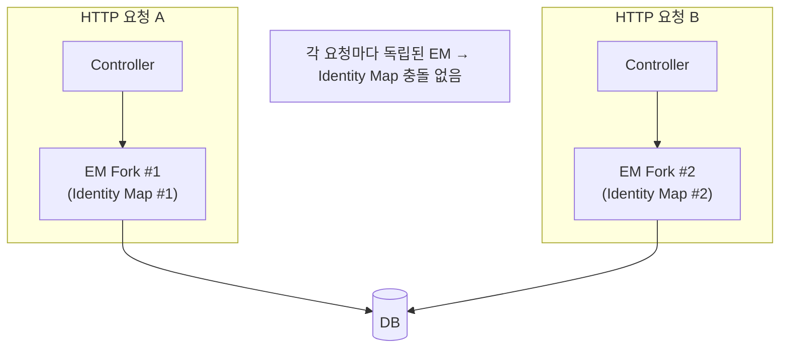
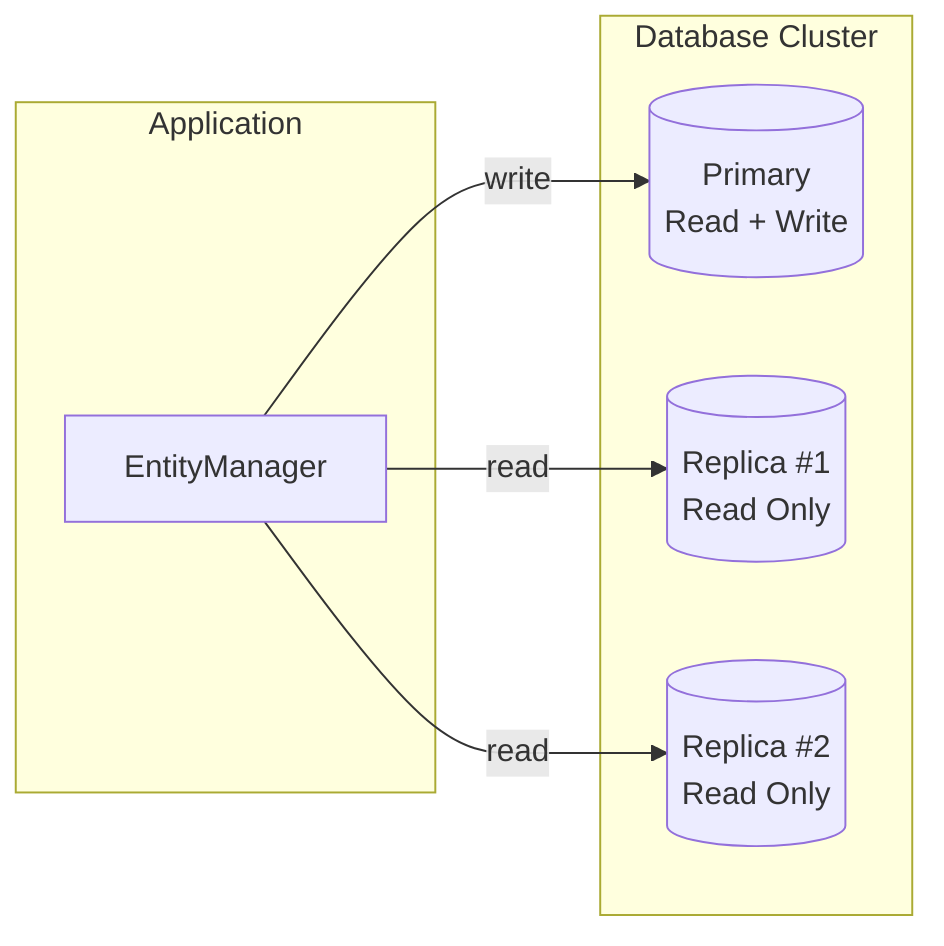

# 13. NestJS 통합 설정

> **핵심 질문**: MikroORM + NestJS 프로젝트를 어떻게 구성하는가?

## 13.1 기본 설정

### 모듈 등록

```typescript
import { Module } from '@nestjs/common';
import { MikroOrmModule } from '@mikro-orm/nestjs';
import { MySqlDriver } from '@mikro-orm/mysql';
import { TsMorphMetadataProvider } from '@mikro-orm/reflection';

@Module({
  imports: [
    MikroOrmModule.forRoot({
      driver: MySqlDriver,
      host: 'localhost',
      port: 3306,
      dbName: 'my_database',
      user: 'root',
      password: 'root',
      entities: ['./dist/**/*.entity.js'],
      entitiesTs: ['./src/**/*.entity.ts'],
      metadataProvider: TsMorphMetadataProvider,  // v7 기본값 — 생략 가능
      debug: true,
      registerRequestContext: true,   // 요청마다 자동 fork
      allowGlobalContext: false,      // 글로벌 EM 직접 사용 차단 (프로덕션 권장)
    }),
    // 엔티티를 리포지토리로 등록
    MikroOrmModule.forFeature([AuthorEntity, BookEntity]),
  ],
})
export class AppModule {}
```

### 필수 의존성

```json
{
  "dependencies": {
    "@mikro-orm/core": "^7.x",
    "@mikro-orm/mysql": "^7.x",
    "@mikro-orm/nestjs": "^7.x",
    "@mikro-orm/reflection": "^7.x",
    "@mikro-orm/decorators": "^7.x"
  }
}
```

### TransactionalExplorer 등록

`@Transactional()` 데코레이터를 서비스에서 사용하려면 `TransactionalExplorer`가 필요하다 (상세 구현은 [11장](./11-transactional-explorer.md) 참고):

```typescript
import { Module } from '@nestjs/common';
import { DiscoveryModule } from '@nestjs/core';
import { MikroOrmModule } from '@mikro-orm/nestjs';
import { TransactionalExplorer } from './jpa-compat/transactional.explorer';

@Module({
  imports: [
    MikroOrmModule.forRoot({ /* ... */ }),
    DiscoveryModule,  // ← DiscoveryService 사용에 필요
  ],
  providers: [
    TransactionalExplorer,  // ← @Transactional() 사용 서비스에 em 자동 주입
    // ... 서비스들
  ],
})
export class AppModule {}
```

> **TransactionalExplorer가 없으면**: `@Transactional()` 메서드가 있는 서비스에서 `em`을 constructor로 직접 주입해야 한다. Explorer가 있으면 이를 자동화한다.

## 13.2 엔티티 정의

```typescript
import { Entity, PrimaryKey, Property, OneToMany, Collection } from '@mikro-orm/core';

@Entity({ tableName: 'authors' })
export class AuthorEntity {
  @PrimaryKey()
  id!: number;

  @Property()
  name!: string;

  @Property({ nullable: true })
  email?: string;

  @OneToMany(() => BookEntity, book => book.author, {
    cascade: [Cascade.PERSIST, Cascade.REMOVE],
    orphanRemoval: true,
  })
  books = new Collection<BookEntity>(this);
}
```

### 커스텀 레포지토리 연결

```typescript
@Entity({
  tableName: 'authors',
  repository: () => AuthorRepository,  // ← 커스텀 레포지토리 지정
})
export class AuthorEntity { /* ... */ }
```

```typescript
// MikroOrmModule.forFeature에 엔티티만 등록하면
// 해당 엔티티의 repository 옵션에 지정된 레포지토리가 자동 등록됨
MikroOrmModule.forFeature([AuthorEntity])
// → AuthorRepository가 자동으로 DI 컨테이너에 등록
```

## 13.3 RequestContext — 요청별 EM 격리



### NestJS 미들웨어 방식

```typescript
import { MikroOrmMiddleware } from '@mikro-orm/nestjs';

@Module({
  imports: [MikroOrmModule.forRoot({ /* ... */ })],
})
export class AppModule implements NestModule {
  configure(consumer: MiddlewareConsumer) {
    consumer.apply(MikroOrmMiddleware).forRoutes('*');
  }
}
```

### allowGlobalContext 설정

| 설정 | 동작 | 용도 |
|------|------|------|
| `false` (권장) | 글로벌 EM으로 직접 쿼리 시 에러 | 프로덕션 |
| `true` | 글로벌 EM 직접 사용 허용 | 초기 개발/디버깅 |

```typescript
// allowGlobalContext: false일 때
orm.em.find(Author, {});           // ❌ 에러 (RC 밖)
orm.em.fork();                     // ✅ fork/getConnection은 영향 없음
orm.em.getConnection();            // ✅

RequestContext.create(orm.em, async () => {
  await orm.em.find(Author, {});   // ✅ RC 안에서는 fork로 위임
});
```

> `orm.em`은 프록시다. `@Transactional()`과 `RequestContext`가 자동으로 fork EM을 제공하므로, `allowGlobalContext: false`에서도 정상 동작한다. 이 설정은 **컨텍스트 없이 실수로 글로벌 EM을 쓰는 것만 차단**한다.

## 13.4 비-HTTP 컨텍스트 (크론, 큐, 워커)

`registerRequestContext: true`는 HTTP 요청에만 적용된다. 크론 잡, SQS 컨슈머 등 비-HTTP 컨텍스트에서는 직접 컨텍스트를 만들어야 한다.

```typescript
// ❌ 크론 잡에서 글로벌 EM 직접 사용 → allowGlobalContext=false이면 에러
@Cron('*/5 * * * *')
async onCron() {
  await this.em.find(Author, {});  // → Error!
}

// ✅ 방법 1: RequestContext.create()로 감싸기
@Cron('*/5 * * * *')
async onCron() {
  await RequestContext.create(this.orm.em, async () => {
    await this.em.find(Author, {});  // ✅ fork EM으로 위임
  });
}

// ✅ 방법 2: 명시적 fork
@Cron('*/5 * * * *')
async onCron() {
  const em = this.orm.em.fork();
  await em.find(Author, {});  // ✅ 독립된 EM
}

// ✅ 방법 3: @Transactional() — this.em이 있어야 동작
// (constructor로 직접 주입하거나 TransactionalExplorer가 자동 주입)
@Cron('*/5 * * * *')
@Transactional()
async onCron() {
  await this.em.find(Author, {});  // ✅ this.em.transactional()이 fork 생성
}
```

```typescript
// ✅ 방법 4: @CreateRequestContext() — NestJS 공식 권장
import { CreateRequestContext } from '@mikro-orm/core';

@Injectable()
class CronService {
  constructor(private readonly orm: MikroORM) {}

  @Cron('*/5 * * * *')
  @CreateRequestContext()  // 메서드 실행 시 자동으로 RequestContext 생성
  async onCron() {
    await this.orm.em.find(Author, {});  // ✅ fork EM으로 위임
  }
}
```

> `@CreateRequestContext()`는 `@mikro-orm/core`에서 제공하는 데코레이터로, 메서드 호출 시 자동으로 `RequestContext.create()`를 래핑한다. 비-HTTP 컨텍스트에서 가장 깔끔한 방식이다.

> SQS 컨슈머, 이벤트 핸들러 등도 동일하다. HTTP 요청 밖이라면 반드시 EM 컨텍스트를 직접 생성해야 한다.

### 중첩 컨텍스트 주의사항

`@CreateRequestContext()`와 `RequestContext.create()`는 **최상위 메서드에서만** 사용해야 한다. 중첩하면 내부 RC가 별도 fork를 생성하여 데이터 불일치가 발생한다.

```typescript
// ❌ 중첩 금지 — 내부 RC는 별도 fork, 외부와 Identity Map 격리
@CreateRequestContext()
async outer() {
  const author = orm.em.create(Author, { name: 'Outer' });
  orm.em.persist(author);

  await this.inner();  // inner에도 @CreateRequestContext()가 있으면?
  // → inner는 별도 fork → outer의 엔티티를 모름
  // → inner의 flush는 outer의 변경사항을 포함하지 않음
}

@CreateRequestContext()  // ← 중첩: 별도 fork 생성
async inner() {
  // 여기서 flush해도 outer의 author는 DB에 반영 안 됨
}
```

```typescript
// ✅ 올바른 패턴 — 최상위에서만 @CreateRequestContext()
@CreateRequestContext()
async handler() {
  await this.step1();  // 일반 메서드 — 같은 RC의 fork EM 공유
  await this.step2();  // 일반 메서드
}

async step1() { /* RC 데코레이터 없음 */ }
async step2() { /* RC 데코레이터 없음 */ }
```

### em.transactional() vs em.fork().transactional()

| 방식 | Identity Map | 용도 |
|------|-------------|------|
| `em.transactional()` | **같은 EM** 공유 | 기존 엔티티의 변경을 트랜잭션으로 감쌀 때 |
| `em.fork().transactional()` | **별도 EM** (격리) | 독립적인 작업을 격리할 때 |

```typescript
const author = await em.findOneOrFail(Author, 1);
author.name = 'Changed';

// em.transactional → 같은 Identity Map
await em.transactional(async (txEm) => {
  const same = await txEm.findOneOrFail(Author, 1);
  same === author;   // true — 같은 인스턴스
  same.name;         // 'Changed' — 메모리 변경 보임
});

// em.fork().transactional → 별도 Identity Map
await em.fork().transactional(async (forkedEm) => {
  const separate = await forkedEm.findOneOrFail(Author, 1);
  separate === author;  // false — 다른 인스턴스
  separate.name;        // DB 값 (fork에서 새로 로드)
});
```

## 13.5 Read Replica 구성



```typescript
MikroOrmModule.forRoot({
  host: 'primary-host',
  port: 3306,
  dbName: 'my_database',
  user: 'root',
  password: 'root',

  // Read Replica 설정
  replicas: [
    { host: 'replica-1-host', port: 3306 },
    { host: 'replica-2-host', port: 3306 },
  ],
})
```

### Read/Write 커넥션 분리 사용

```typescript
const em = orm.em.fork();

// 읽기 커넥션 (replica로 자동 라우팅)
const readConn = em.getConnection('read');

// 쓰기 커넥션 (primary로 라우팅)
const writeConn = em.getConnection('write');

// replicas 미설정 시 둘 다 같은 커넥션

// em.find() 등에서 connectionType 지정
import { ConnectionType } from '@mikro-orm/core';
const authors = await em.find(Author, {}, {
  connectionType: ConnectionType.READ,  // 명시적으로 replica 사용
});
```

### preferReadReplicas 옵션

```typescript
MikroOrmModule.forRoot({
  // ...
  replicas: [{ host: 'replica-1-host' }],
  preferReadReplicas: true,  // 기본값: true
  // true면 SELECT 쿼리가 자동으로 replica로 라우팅됨
  // false면 모든 쿼리가 primary로 전송됨
})
```

## 13.6 MetadataProvider 선택

| Provider | 장점 | 단점 | 추천 |
|----------|------|------|------|
| `TsMorphMetadataProvider` | **v7 기본값**, 데코레이터만으로 타입 추론, `reflect-metadata` 불필요, 레거시/ES 데코레이터 모두 지원 | 초기 부팅 시 파일 파싱 비용, `@mikro-orm/reflection` 패키지 필요 | 대부분의 경우 (v7 기본) |
| `ReflectMetadataProvider` | 빠른 부팅 | `reflect-metadata` + `emitDecoratorMetadata` 필요, v7에서는 레거시 데코레이터(`experimentalDecorators`) 필수, `@mikro-orm/decorators/legacy`에서 제공 | 레거시 데코레이터 사용 프로젝트 |

> **v6 → v7 변경사항**: v7에서 `ReflectMetadataProvider`는 더 이상 기본값이 아니다. `TsMorphMetadataProvider`가 v7의 기본 MetadataProvider이다. 레거시 데코레이터를 계속 사용하려면 `ReflectMetadataProvider`를 명시적으로 설정해야 한다.

```typescript
// v7 기본값은 TsMorphMetadataProvider — metadataProvider를 생략하면 적용됨
import { TsMorphMetadataProvider } from '@mikro-orm/reflection';

MikroOrmModule.forRoot({
  // metadataProvider 생략 → TsMorphMetadataProvider 사용 (v7 기본)
  entities: ['./dist/**/*.entity.js'],
  entitiesTs: ['./src/**/*.entity.ts'],  // ← ts-morph가 소스 파일을 직접 파싱
})

// 레거시 데코레이터 프로젝트에서 ReflectMetadataProvider 사용 시
import { ReflectMetadataProvider } from '@mikro-orm/decorators/legacy';

MikroOrmModule.forRoot({
  metadataProvider: ReflectMetadataProvider,  // ← 명시적 설정 필요 (v7에서 기본값 아님)
  entities: ['./dist/**/*.entity.js'],
})
```

## 13.7 테스트 환경 설정

### NestJS Testing Module

```typescript
import { Test, TestingModule } from '@nestjs/testing';
import { INestApplication } from '@nestjs/common';
import { MikroORM } from '@mikro-orm/core';

export async function createTestingApp() {
  const module: TestingModule = await Test.createTestingModule({
    imports: [AppModule],
  }).compile();

  const app = module.createNestApplication();
  await app.init();

  const orm = module.get(MikroORM);

  return { app, orm, module };
}
```

### 테스트 간 데이터 초기화

```typescript
export async function resetSchema(orm: MikroORM) {
  const em = orm.em.fork();
  const knex = em.getKnex();

  await knex.raw('SET FOREIGN_KEY_CHECKS = 0');
  await knex('books').truncate();
  await knex('authors').truncate();
  await knex.raw('SET FOREIGN_KEY_CHECKS = 1');
}
```

### vitest 설정

```typescript
// vitest.config.ts
import { defineConfig } from 'vitest/config';

export default defineConfig({
  test: {
    pool: 'forks',
    poolOptions: {
      forks: { singleFork: true },  // DB 공유 → 직렬 실행 필수
    },
  },
});
```

> **중요**: 테스트는 같은 DB를 사용하므로 **직렬 실행** (`singleFork: true`)으로 설정. 병렬 실행 시 Identity Map 충돌 및 데이터 경합 발생.

## 13.8 프로젝트 구조 예시

```
src/
├── app.module.ts              # 루트 모듈
├── entities/
│   ├── author.entity.ts       # @Entity 정의
│   └── book.entity.ts
├── repositories/
│   ├── base.repository.ts     # JPA-like BaseRepository
│   ├── author.repository.ts   # 커스텀 레포지토리
│   └── book.repository.ts
├── services/
│   └── author.service.ts      # 비즈니스 로직
├── jpa-compat/
│   ├── transactional.decorator.ts  # 커스텀 @Transactional()
│   ├── transactional.explorer.ts   # em 자동 주입
│   └── index.ts
└── test/
    ├── behavior/              # ORM 동작 검증 테스트
    │   ├── setup.ts
    │   └── *.spec.ts
    └── jpa-compat/            # JPA 호환 레이어 테스트
        ├── setup.ts
        └── *.spec.ts
```

## 13.9 검증된 동작 (테스트 기반)

| 테스트 | 검증 내용 |
|--------|----------|
| 4-2 | allowGlobalContext=false → 글로벌 EM 직접 사용 시 에러 |
| 4-6 | orm.em은 프록시 (참조 동일, fork마다 별개, RC마다 다른 fork) |
| 4-7 | DI 주입 EM === orm.em (프록시 하나), RC 안에서 같은 fork |
| 8-1~2 | RequestContext — 요청별 EM 격리 |
| 8-3 | 글로벌 EM 직접 사용 → allowGlobalContext=false이면 에러 |
| 9-1 | E2E: POST 요청 → registerRequestContext가 자동 fork → INSERT 성공 |
| 9-2 | E2E: GET 요청 → 자동 fork EM으로 SELECT 성공 |
| 9-3 | E2E: 연속 요청 → 각 요청이 독립된 Identity Map 사용 |
| 9-4 | E2E: 목록 조회가 이전 요청의 Identity Map에 영향받지 않음 |
| 9-5 | E2E: 요청 간 데이터 격리 — POST commit 후 GET으로 즉시 조회 가능 |
| 11-1~5 | TransactionalExplorer — em 자동 주입 |
| 11-15 | getConnection('read'/'write') API 확인 |
| 14-1 | 중첩 RC → 내부/외부 RC는 별도 fork (EM 인스턴스 다름) |
| 14-2 | 중첩 RC — 내부 flush가 외부 변경사항에 영향 없음 |
| 14-3 | 중첩 RC — 내부에서 생성한 엔티티가 외부 Identity Map에 없음 |
| 14-4 | em.fork().transactional → 별도 Identity Map (원본 영향 없음) |
| 14-5 | em.transactional → 같은 Identity Map 공유 (같은 인스턴스) |

---

[← 이전: 12. BaseRepository](./12-base-repository.md) | [다음: 14. 트러블슈팅 →](./14-troubleshooting.md)
