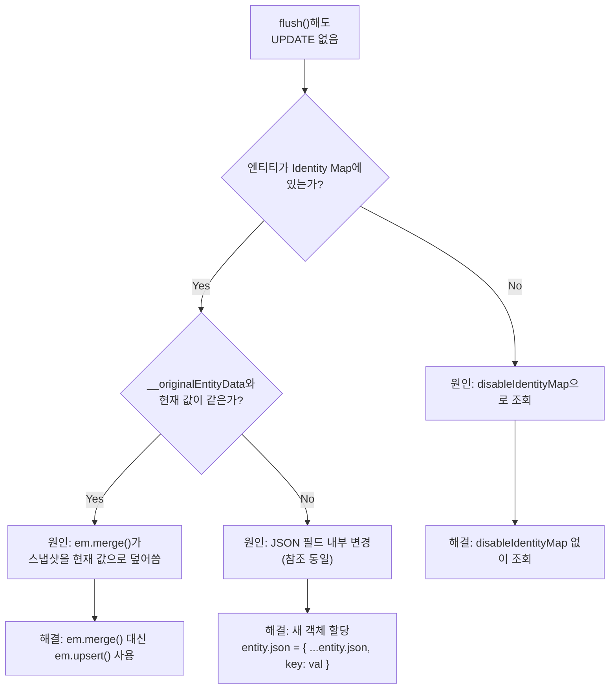
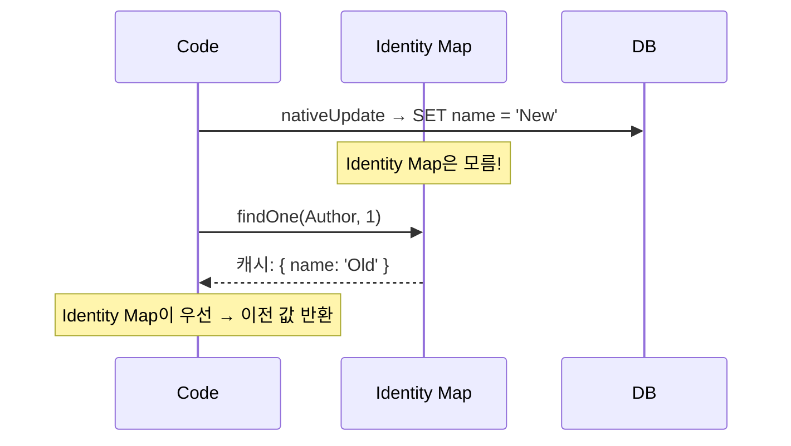
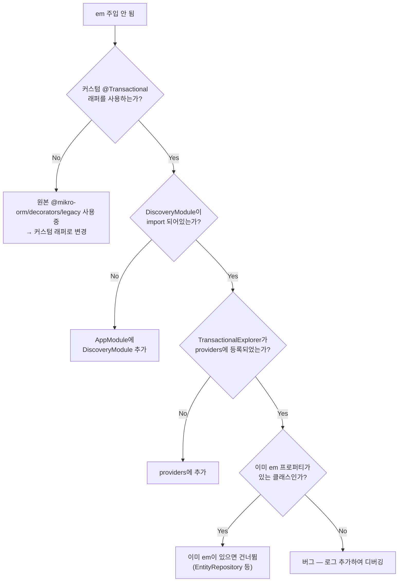

# 14. 트러블슈팅 & FAQ

> **핵심 질문**: 실전에서 자주 만나는 문제와 해결법은?

## FAQ 1: flush()해도 UPDATE가 안 된다

### 증상

```typescript
const author = await em.findOne(Author, 1);
author.name = 'Changed';
await em.flush();
// → UPDATE SQL이 발생하지 않음
```

### 원인과 해결



| 원인 | 해결 |
|------|------|
| `disableIdentityMap: true`로 조회 | 옵션 제거 또는 별도 EM으로 조회 |
| `em.merge()`로 detached 엔티티 등록 | `em.upsert()` 사용 |
| JSON 필드 내부 변경 | 새 객체로 재할당 |
| 아예 다른 EM에서 로드한 엔티티 | 같은 EM에서 다시 조회하거나 `em.upsert()` |

## FAQ 2: @Transactional() 안에서 remove()가 동작 안 한다

### 증상

```typescript
@Transactional()
async deleteUser(entity: UserEntity): Promise<void> {
  this.em.remove(entity);
  await this.em.flush();
  // → DELETE SQL 없음
}
```

### 원인

```
caller EM (entity가 속한 EM)  ≠  @Transactional()이 생성한 EM fork

→ remove(entity)를 호출해도, entity가 트랜잭션 EM의 Identity Map에 없음
→ flush 시 "변경 사항 없음" 판단 → SQL 없음
```

### 해결

```typescript
// 방법 1: @Transactional() 제거 → flush가 자체 트랜잭션 처리
async delete(entity: T): Promise<void> {
  this.em.remove(entity);
  await this.em.flush();
}

// 방법 2: 트랜잭션 안에서 직접 조회 후 remove
@Transactional()
async deleteById(id: Primary<T>): Promise<void> {
  const entity = await this.findOneOrFail(id as FilterQuery<T>);
  // ↑ 트랜잭션 EM에서 직접 로드 → Identity Map에 등록됨
  this.em.remove(entity);
  await this.em.flush();
}
```

## FAQ 3: nativeUpdate 후 조회하면 이전 값이 나온다

### 증상

```typescript
await em.nativeUpdate(Author, { id: 1 }, { name: 'New' });
const author = await em.findOne(Author, 1);
console.log(author.name);  // 'Old' ← 왜?
```

### 원인과 해결



```typescript
// 해결 1: 새 EM 사용
const fresh = orm.em.fork();
const author = await fresh.findOne(Author, 1);  // DB에서 직접 조회

// 해결 2: em.refresh()
await em.refresh(author);  // DB에서 다시 로드

// 해결 3: nativeUpdate 후 같은 EM에서 조회하지 않기
```

## FAQ 4: "Collection not initialized" 에러

### 증상

```
Collection<Book> of entity Author[1] not initialized
```

### 원인과 해결

```typescript
// ❌ populate 없이 collection 접근
const author = await em.findOne(Author, 1);
author.books.getItems();  // → Error!

// ✅ populate으로 미리 로드
const author = await em.findOne(Author, 1, { populate: ['books'] });
author.books.getItems();  // OK

// ✅ 또는 lazy init
await author.books.init();
author.books.getItems();  // OK
```

## FAQ 5: 비관적 잠금이 에러를 던진다

### 증상

```
Pessimistic locking requires a transaction
```

### 원인과 해결

```typescript
// ❌ 트랜잭션 없이 사용
await em.findOne(Author, 1, {
  lockMode: LockMode.PESSIMISTIC_WRITE,
});

// ✅ 트랜잭션 안에서 사용
await em.transactional(async (txEm) => {
  await txEm.findOne(Author, 1, {
    lockMode: LockMode.PESSIMISTIC_WRITE,
  });
});
```

## FAQ 6: FlushMode.AUTO가 의도치 않은 INSERT를 실행한다

### 증상

```typescript
const author = em.create(Author, { name: 'Pending' });
em.persist(author);

// 아직 flush 안 했는데 SELECT가 INSERT를 유발
const all = await em.find(Author, {});
// → AUTO 모드에서 persist된 pending 엔티티가 먼저 INSERT됨
```

### 해결

```typescript
// FlushMode.COMMIT → 명시적 flush/commit 전까지 자동 flush 없음
const em = orm.em.fork({ flushMode: FlushMode.COMMIT });

// 또는 트랜잭션에 FlushMode 지정
await em.transactional(
  async (txEm) => { /* ... */ },
  { flushMode: FlushMode.COMMIT },
);
```

## FAQ 7: TransactionalExplorer가 em을 주입하지 않는다

### 체크리스트



## FAQ 8: readOnly 트랜잭션에서 INSERT/UPDATE가 거부된다

### 예상된 동작

```
readOnly: true → MySQL의 SET TRANSACTION READ ONLY

이것은 ORM 레벨이 아니라 DB 레벨 제한이다.
→ SELECT만 허용
→ INSERT, UPDATE, DELETE → DB가 에러 반환
```

```typescript
// readOnly 트랜잭션은 조회 전용
await em.transactional(
  async (txEm) => {
    // ✅ SELECT → 정상
    const authors = await txEm.find(Author, {});

    // ❌ INSERT → DB 에러
    txEm.create(Author, { name: 'New' });
    await txEm.flush();  // → Error
  },
  { readOnly: true },
);
```

## FAQ 9: "Using global EntityManager instance methods" 에러

### 증상

```
ValidationError: Using global EntityManager instance methods for context
specific actions is disallowed.
```

### 원인

`allowGlobalContext: false` 설정에서 RequestContext나 `@Transactional()` 없이 글로벌 EM을 직접 사용했다.

```typescript
// ❌ RC도 @Transactional()도 없이 글로벌 EM 사용
@Injectable()
class MyService {
  constructor(private em: EntityManager) {}

  async doSomething() {
    await this.em.find(Author, {});  // → 에러!
  }
}
```

### 해결

```typescript
// 방법 1: @Transactional() 사용 → 자동 fork
@Transactional()
async doSomething() {
  await this.em.find(Author, {});  // ✅
}

// 방법 2: 명시적 fork
async doSomething() {
  const em = this.orm.em.fork();
  await em.find(Author, {});  // ✅
}

// 방법 3: RequestContext로 감싸기 (크론, 큐 등 비-HTTP 컨텍스트)
async onCron() {
  await RequestContext.create(this.orm.em, async () => {
    await this.em.find(Author, {});  // ✅
  });
}
```

> `orm.em`은 프록시다. `fork()`, `getConnection()` 같은 메타 연산은 `allowGlobalContext: false`에서도 정상 동작한다. 에러가 나는 건 `find`, `persist`, `flush` 등 Identity Map을 쓰는 연산뿐이다.

## FAQ 10: 디버깅 팁

### 쿼리 로그 활성화

```typescript
MikroOrmModule.forRoot({
  debug: true,  // 모든 쿼리를 콘솔에 출력
  // 또는 특정 타입만
  debug: ['query', 'query-params'],
})
```

### 엔티티 상태 확인

```typescript
import { helper } from '@mikro-orm/core';

const wrapped = helper(entity);
console.log({
  managed: wrapped.__managed,
  em: wrapped.__em?.constructor.name,
  hasPK: wrapped.hasPrimaryKey(),
  originalData: wrapped.__originalEntityData,
});
```

### Unit of Work 확인

```typescript
const uow = em.getUnitOfWork();
const identityMap = uow.getIdentityMap();
const managed = [...identityMap.values()];
console.log(`Identity Map에 ${managed.length}개 엔티티`);
```

---

[← 이전: 13. NestJS 통합 설정](./13-nestjs-integration.md) | [부록 A: JPA 치트시트 →](./appendix-a-jpa-cheatsheet.md)
